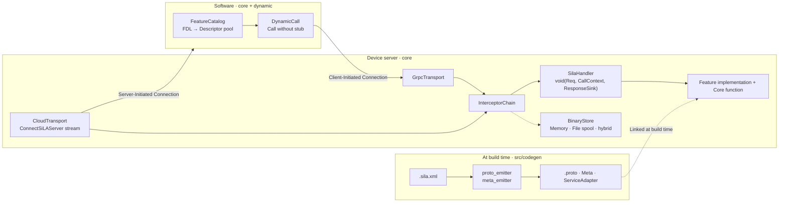
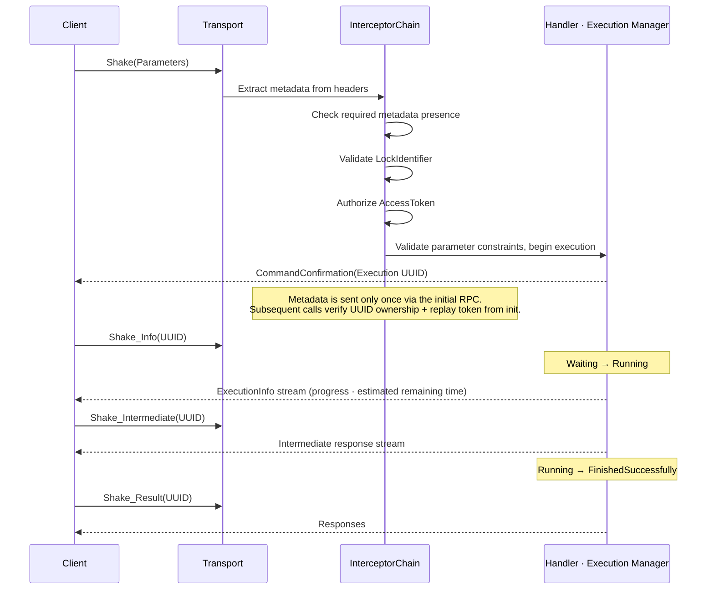

# sila_cpp_r

> **[한국어 문서 (Korean)](reference/docs/README_ko.md)**

A C++20 implementation of SiLA 2 (Standardization in Lab Automation), conforming to specification v1.1.  
A gRPC-based standard protocol for communication between laboratory instruments and software.  

v0.81-Beta.

## Overview

SiLA is an open standard that defines communication between SiLA Servers and Clients using gRPC and a standardized FDL (Feature Definition Language; XML) schema, aiming to enable interoperability, flexibility, and resource optimization for instrument integration and software services in laboratory automation.

This repository conforms to the specification documents released on March 19, 2022, and is built upon:
- [SiLA 2 Part (A) - Overview, Concepts and Core Specification](https://sila-standard.com/wp-content/uploads/2022/03/SiLA-2-Part-A-Overview-Concepts-and-Core-Specification-v1.1.pdf)  
- [SiLA 2 Part (B) - Mapping Specification](https://sila-standard.com/wp-content/uploads/2022/03/SiLA-2-Part-B-Mapping-Specification-v1.1.pdf)  
- [sila_base repository](https://gitlab.com/SiLA2/sila_base)  

Other implementations referenced during development:
- [sila_cpp repository](https://gitlab.com/SiLA2/sila_cpp)    
- [sila_java repository](https://gitlab.com/SiLA2/sila_java)  
- [sila_python repository](https://gitlab.com/SiLA2/sila_python)  

The SiLA protocol lets you send commands to instruments and receive measurements in real time through a standardized FDL. The specification defines instruments that support the SiLA protocol as Servers and the software that controls them as Clients. For the two to communicate, the Client must have the Server's FDL — either presented by the Server on first connection (`SiLAService::GetFeatureDefinition`) or distributed separately by the vendor (`FeatureCatalog::add`).

This is a **re**-implementation of the SiLA protocol in C++, removing the Qt dependency from the original `sila_cpp` for real-world embedded use.

## Library Structure

- `sila_cpp_r::core` — Server instance creation, static stub client, binary transfer, cloud connectivity, authentication & authorization, error recovery, mDNS discovery, FDL runtime parsing & constraint validation
- `sila_cpp_r::dynamic` — Operates on top of `sila_cpp_r::core`; connects to core's channel (`grpc::Channel`), injector (`MetadataInjector`), etc. Builds protobuf descriptors from parsed FDL to make dynamic RPC calls without stubs.

The two sub-libraries are designed for different use cases:
- **`sila_cpp_r::dynamic`** is designed for software that receives messages from multiple instruments and needs to interpret protobuf messages unknown at build time.
- **`sila_cpp_r::core`** is designed for resource-constrained instruments whose features are already defined by hardware. When using `sila_cpp_r::core`, codegen converts the instrument's FDL to `.proto` IDL (Interface Description Language), then compiles it with `protoc`/`grpc_cpp_plugin` to produce static stubs.

| | Instrument (SiLA Server) | Software (SiLA Client) |
|---|---|---|
| Stub | codegen FDL conversion → `.proto` + static stub + Metadata | None — dynamically interprets the peer's FDL |
| Link | `sila_cpp_r::core` | `sila_cpp_r::dynamic` (+`sila_cpp_r::core`) |
| FDL runtime interpretation | Parameter constraint validation (`CommandParameterValidator.cc`) | Parameter constraint validation + dynamic message serialization/deserialization |

## Architecture



## Protocol Flow




## Differences from sila_cpp

Compared to the official SiLA C++ reference [sila_cpp](https://gitlab.com/SiLA2/sila_cpp), this repository was designed to minimize dependencies for real-world use embedded alongside instrument drivers.

| | sila_cpp | This repo |
|---|---|---|
| Foundation | Qt5 Core (`QObject`, Qt PIMPL) | Standard C++20, no Qt |
| Dependencies | Conan v1 or system install | vcpkg manifest + submodules |
| mDNS | Avahi (Linux) / Bonjour (Windows) | Single-header `mdns`, cross-platform |
| Code generation | FDL parser embedded in C++ | Python + Jinja2 build tool, pinned via golden files |
| Transport layer | Direct gRPC coupling | `SilaHandler` / `ResponseSink` / `CallContext` abstraction — gRPC and cloud paths share the same handler |
| Testing | Catch2 | GoogleTest + pytest + sanitizer presets + libFuzzer + interop tests |

While `sila_cpp` implements only SiLAService, Observable commands/properties, discovery, and dynamic client, this repository additionally covers Binary Transfer (Part B), Cloud Connectivity (Part B), Error Recovery, Authentication, Authorization, Locking, and Simulation (Part C) as specified in the SiLA 2 Specification.


## Requirements

- CMake ≥3.25
- C++20 (GCC 13+ or Clang 16+)
- Python ≥3.10
- uv
- vcpkg
- Submodule `third_party/sila_base` — specification sources, schemas, protos; required for build

#### Codegen Python packages (`src/codegen/pyproject.toml` / `uv.lock`)

| Package | Version | Purpose |
|---------|---------|--------|
| `lxml` | 6.1.2 | FDL XSD validation & XML parsing |
| `xsdata` | 26.2 | FDL XSD → Python data binding generation |
| `Jinja2` | 3.1.6 | `.proto` / Meta template rendering |
| `pytest` | 9.1.1 | Codegen tests (uv `validation` group, optional) |
| `sila2` | 0.14.0 | Cross-language validation — SiLA 2 Python implementation (uv `validation` group, optional) |

#### vcpkg dependencies (`vcpkg.json`)

| Package | Version | Purpose |
|---------|---------|--------|
| `protobuf` | 6.33.4 | gRPC message serialization |
| `grpc` | 1.81.1 (overlay) | RPC transport |
| `libxml2` | 2.15.3 | FDL XSD validation (runtime) |
| `libxslt` | 1.1.45 | FDL normalization transform (runtime) |
| `mdns` | 1.4.3 (overlay) | mDNS discovery |
| `nlohmann-json` | 3.12.0 | JSON parsing |
| `json-schema-validator` | 2.4.0 | JSON Schema validation |
| `boringssl` | 2025-08-18 | TLS |
| `gtest` | 1.17.0 | Tests |
| `opentelemetry-cpp` | 1.28.0 | Optional feature `otel` — OpenTelemetry instrumentation |

## build

```bash
git clone --recursive <repo-url>
cd sila_cpp_r

cmake --preset default
cmake --build build/gcc
```

| Preset | build directory | Purpose |
|---|---|---|
| `default` | `build/gcc` | GCC, RelWithDebInfo |
| `clang` | `build/clang` | Clang build |
| `asan` | `build/asan` | AddressSanitizer + UBSan, memory checking |
| `tsan` | `build/tsan` | ThreadSanitizer (Clang; GCC TSan has WSL2 ASLR issues) |
| `otel` | `build/otel` | OpenTelemetry tracing enabled |
| `fuzz` | `build/fuzz` | libFuzzer targets |

API reference: `cmake --build build/gcc --target docs` (requires `doxygen` on PATH; output at `build/gcc/html/index.html`).

## Testing

```bash
uv sync --directory src/codegen                       # codegen
uv sync --directory src/codegen --group validation    # + cross-validation suite
```

Some `ctest` suites include pytest, so Python interpreter sync is required before running `ctest`.

```bash
ctest --preset default             # all
ctest --preset default -R codegen  # codegen only
ctest --preset asan                # memory / undefined behavior
ctest --preset tsan                # data races

cmake --preset fuzz && cmake --build build/fuzz # fuzzing
./build/fuzz/tests/fuzz/fuzz_fdl_parser -max_total_time=60
```


### Verification Coverage

| Area | Method & Result |
| --- | --- |
| Memory integrity | ASan + UBSan: all tests verified under AddressSanitizer and UndefinedBehaviorSanitizer. |
| Data races | TSan (Clang) — internal gRPC/abseil/BoringSSL races handled with namespace-level suppressions; 0 races in application code. A known termination-order race in OwnedComponents destructor during gRPC teardown is a shutdown-time issue with no runtime defect detected in the current verification scope. |
| Input robustness | 4 fuzz targets (FDL parser, mDNS packet parser, `CloudEnvelopeRouter`, `JsonCodec`) — 0 crashes. |
| Test stability | Full suite repeated 20 times in a soak test — 0 flaky tests. |
| Portability | GCC and Clang builds verified; full test suite also passes with OTel-enabled builds. |

## Quick Example

Using BioShake QX's `TemperatureController.sila.xml`:

### Codegen

```bash
cd src/codegen
python -m codegen ../../tests/examples/fdl/bioshake-qx/TemperatureController.sila.xml -o generated/
# generated/
#   TemperatureController.proto
#   TemperatureControllerMeta.h/.cc
#   TemperatureControllerServiceAdapter.h
```

Codegen produces a proto file, Meta header/source, and adapter header. Include these in the server (instrument) code.
- `<...>.proto`: protobuf IDL. Compile with `protoc`/`grpc_cpp_plugin` for static stubs.
- `<...>Meta.h/.cc`: Header containing the FQI (Fully Qualified Identifier), and source with the FDL XML embedded as a raw string literal.
- `<...>ServiceAdapter.h` — gRPC service class. On each RPC, `dispatchToHandler` runs registered interceptors in order (`InterceptorChain::intercept()`); if all pass, it invokes the `SilaHandler<Req, Resp>` callback.

Uses `third_party/sila_base/schema/FeatureDefinition.xsd` for XML transformation.  
Override the path with `--xsd` if it changes.

### Server

```cpp
namespace gen = sila2::generated::temperaturecontroller;

sila2::SilaServerBase::Builder builder;
builder.withSelfSignedCertificate("localhost", "127.0.0.1")
       .withConfig(std::make_unique<sila2::InMemoryServerConfig>("BioShakeQX"));

// TemperatureControllerImpl embeds the codegen-generated
// TemperatureControllerServiceAdapter and registers handlers
// for each RPC in its constructor.
TemperatureControllerImpl impl(builder.chain());

// addFeature registers the FQI ID, FDL XML, and gRPC service pointer
// (TemperatureControllerServiceAdapter) with the server.
// Chain With...() methods for discovery, binary transfer, authentication,
// error recovery, and cloud connectivity.
// build() creates and registers the interceptors and gRPC services
// configured by the preceding methods.
auto server = builder
    .addFeature(std::string{gen::kFqi}, std::string{gen::kFdlXml}, impl.service())
    .registerCommandManager(&impl.commandManager())
    .withDiscovery(50052)
    .build();

server.run(true);
```

### Client

```cpp
// Namespace generated from .proto
namespace tc = sila2::org::silastandard::examples::temperaturecontroller::v1;

// TLS CA + login credentials: automatically obtains a token on connect
// and injects it into RPC headers
sila2::ClientConfig config;
config.setTlsCredentials({.caCertificatePem = serverCaPem});
config.setUserCredentials("alice", "secret");

sila2::SilaClientBase client{"127.0.0.1", 50052, std::move(config)};
auto stub = client.createStub<tc::TemperatureController::Stub>();
client.authenticate(serverUuid);
```

## Directory Structure

```
src/
  codegen/                                  FDL → proto / Meta / adapter generator (Python, Jinja2)
  sila/
    common/
      error/
        SilaError.h/.cc                     Framework · Validation · DefinedExecution · Undefined error types
      types/
        BasicTypes.h                        SiLA basic types (Integer, Real, String, etc.) C++ mapping
        Constraints.h/.cc                   FDL constraint definitions & validation
      tls/
        UntrustedTlsCredentials.h/.cc       Self-signed certificate TLS credentials
      proto/                                Core feature .proto sources (SiLAService, AuthenticationService, etc.)
      discovery/
        MdnsSocketPair.h                    mDNS socket — shared by server & client
    server/
      SilaServerBase.h/.cc                  Server builder — configure with With...() methods, create with build()
      FeatureRegistry.h/.cc                 Feature FQI / FDL / gRPC service registration & lookup
      SilaServiceImpl.h/.cc                 SiLAService implementation — GetFeatureDefinition and other core RPCs
      CommandParameterValidator.h/.cc       FDL constraint-based parameter runtime validation
      config/
        ServerConfig.h/.cc                  Server configuration persistence
        TlsConfig.h/.cc                     TLS certificate & key configuration
      command/
        ObservableCommandExecution.h/.cc    State machine (Waiting → Running → Finished)
        ObservableCommandManager.h/.cc      Execution instance creation, lookup & GC
      property/
        ObservablePropertyManager.h/.cc     Observable Property subscription & broadcast
      binary/
        BinaryStore.h/.cc                   Storage interface + 3 implementations (InMemory, FileSpool, Hybrid)
        BinaryUploadService.h/.cc           Upload gRPC service
        BinaryDownloadService.h/.cc         Download gRPC service
      auth/
        AuthTokenStore.h/.cc                Token issuance, verification & expiry management
        AuthorizationInterceptor.h/.cc      Per-RPC access token checking interceptor
        AccessPolicy.h                      Per-FQI access policy interface
        CredentialVerifier.h                User credential verification interface
      recovery/
        RecoverableErrorGate.h/.cc          Recoverable error wait / resume / abort
        ErrorRecoveryServiceImpl.h/.cc      ErrorRecoveryService gRPC implementation
      features/
        AuthenticationServiceImpl.h/.cc     Authentication
        LockControllerImpl.h/.cc            Lock control
        SimulationControllerImpl.h/.cc      Simulation mode
        ConnectionConfigurationServiceImpl.h/.cc  Cloud connection configuration
      transport/
        SilaHandler.h                       Handler callback — void(Req, CallContext, ResponseSink)
        ResponseSink.h                      Response channel abstraction — shared by gRPC & cloud
        CallContext.h/.cc                   RPC metadata access
        InterceptorChain.h                  Interceptor chain — auth, binary, lock, log
        GrpcTransport.h/.cc                 Direct gRPC transport
        cloud/
          CloudTransport.h/.cc              Server-initiated connection (ConnectSiLAServer stream)
          CloudEnvelopeRouter.h/.cc         Envelope deserialization & handler dispatch
          StreamWriteSerializer.h/.cc       Concurrent stream write serialization
      metadata/
        MetadataExtractingInterceptor.h/.cc SiLA metadata extraction from gRPC headers
      discovery/
        MdnsPublisher.h/.cc                 mDNS service publishing
    client/
      SilaClientBase.h/.cc                  Static stub client — TLS channel, authentication, metadata injection
      ClientConfig.h/.cc                    TLS & user credential configuration
      MetadataInjector.h/.cc                Automatic gRPC metadata injection (lock / auth token)
      AuthSession.h/.cc                     Authentication session — token issuance & renewal
      dynamic/
        FeatureCatalog.h/.cc                FDL → Descriptor pool registration & lookup
        FdlRuntimeParser.h/.cc              FDL XML runtime parsing
        DescriptorBuilder.h/.cc             Parsed FDL → protobuf Descriptor creation
        DynamicCall.h/.cc                   Dynamic RPC call without stubs
        JsonCodec.h/.cc                     JSON ↔ protobuf conversion
      binary/
        BinaryUploader.h/.cc                Chunk upload & retry
        BinaryDownloader.h/.cc              Chunk download & retry
      discovery/
        MdnsBrowser.h/.cc                   mDNS service browsing
tests/
  sila/               Unit & integration tests (gtest)
  codegen/            Generator tests & golden files (pytest)
  examples/           ShakeController example server & end-to-end tests
  interop/            Interoperability tests
  fuzz/               FDL parser, JSON codec, mDNS parser, cloud router fuzzing
  validation/         Driver validation (pytest)
  physical/           Raspberry Pi hardware validation scripts
reference/
  sila2-specification/  Part A / B / C specification PDFs
  docs/                 Design documents
```

## License

This project is distributed under the [MIT License](LICENSE), the same license used by other SiLA 2 implementations (`sila_python`, `sila_java`, `sila_cpp`).
