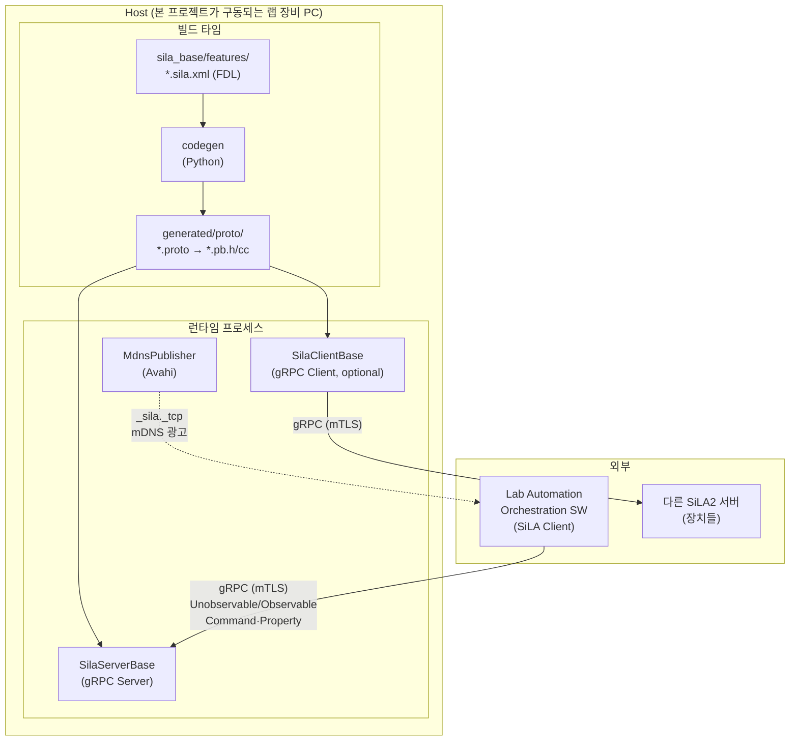
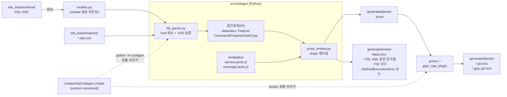
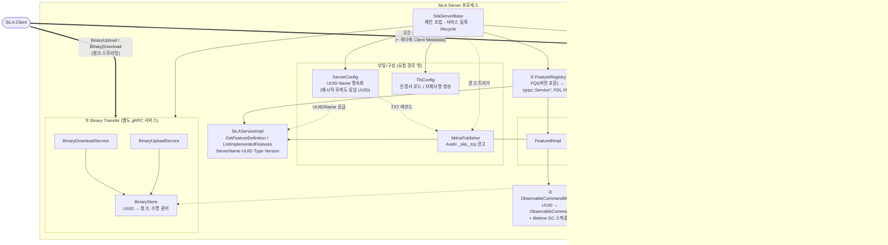
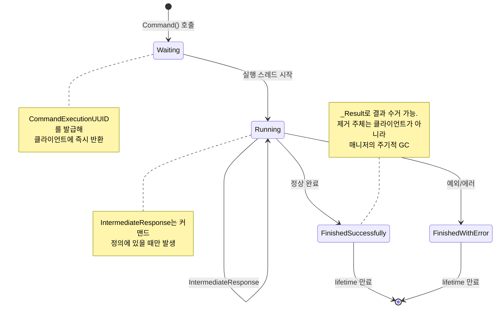
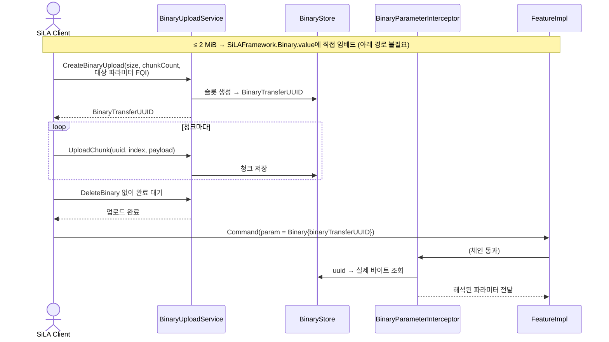
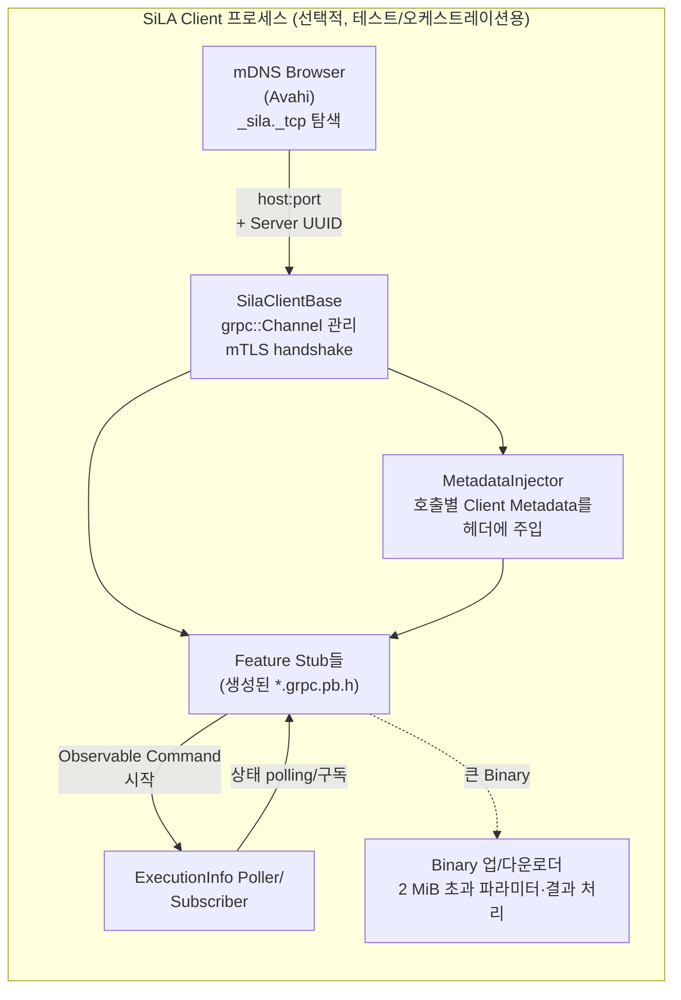
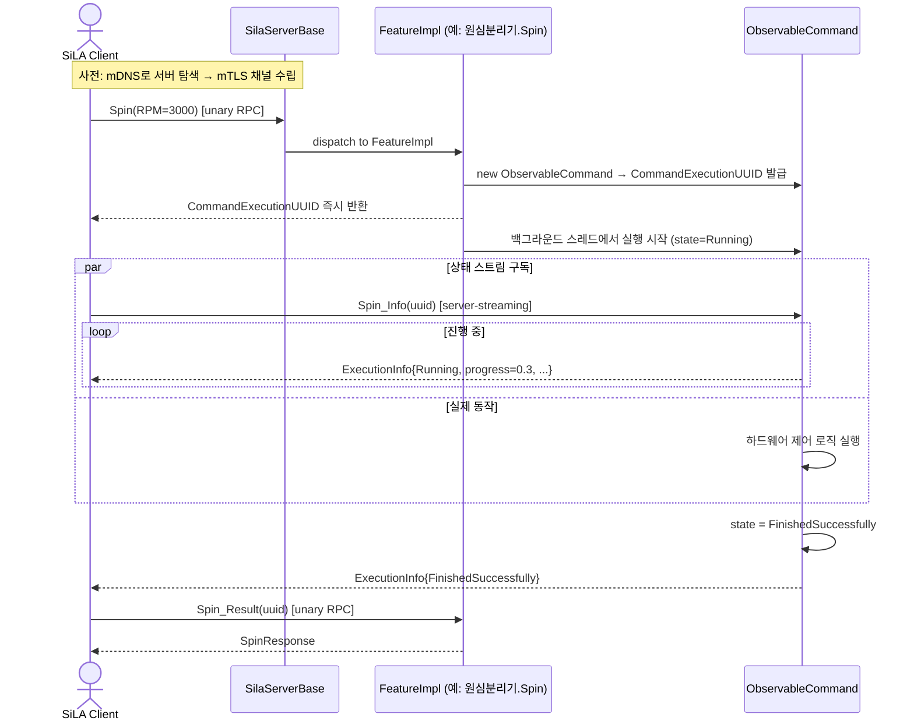
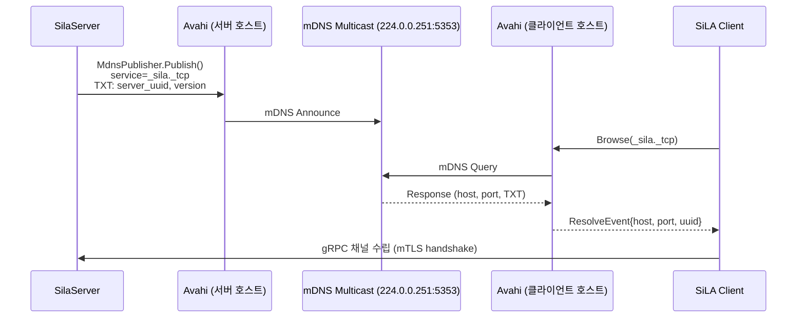
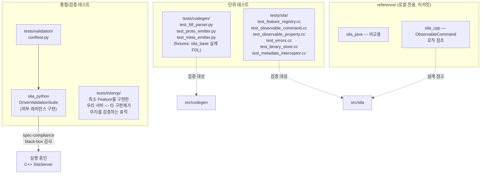

# sila2_cpp_foundation — Architecture

SiLA2(Standardization in Lab Automation) 표준을 C++/gRPC 코어 위에 구현 프로젝트 설계 문서.  
빌드 타임(코드 생성)과 런타임(서버/클라이언트) 분리가 목표.

## 1. 시스템 컨텍스트

- **빌드 타임**: `sila_base` 서브모듈의 FDL(XML)을 파싱 후 `.proto`를 생성한 뒤, `protoc`/`grpc_cpp_plugin`으로 `generated/`에 C++ stub 생성.
- **런타임**: 생성된 stub 위에 손으로 작성한 `src/sila/` 코어(서버 베이스, observable 커맨드 상태 머신, mDNS 퍼블리셔)가 얹힌다. 실제 장치 제어 로직(Feature 구현체)은 이 코어를 상속/조합하여 작성.

## 2. 코드 생성 파이프라인 (빌드 타임)

- `CMakeLists.txt`(최상위) → `cmake/SilaCodegen.cmake`가 각 `*.sila.xml`에 대해 `python -m codegen`을 커스텀 커맨드로 등록.
- FDL은 SiLA2의 커맨드/프로퍼티/데이터타입 정의이며, 이걸 gRPC service/message로 1:1 변환하는 것이 codegen의 책임.
- `SiLAFramework.proto`(sila_base 제공, 공통 타입: `String`, `Integer`, `ExecutionInfo`, `SiLAError`, `Binary` 등)는 모든 Feature `.proto`가 import한다.
- **IR은 손으로 파싱하지 않는다.** FDL XSD로부터 `xsdata`로 dataclass 바인딩을 생성하고 파서는 그 위의 얇은 정규화 층만 담당한다 — sila_base 태그를 올렸을 때 스키마 변경이 조용히 무시되지 않고 생성 단계에서 드러나게 하려는 것. (sila_java는 같은 이유로 XSD → JAXB 바인딩을 쓴다.)
- **codegen 산출물은 `.proto`만이 아니다.** `SiLAService.GetFeatureDefinition`은 FDL XML을 **원문 그대로** 돌려줘야 하는데 C++에는 리소스 개념이 없으므로, XML 원문을 문자열 상수로 담은 `<Feature>Meta.cc`를 함께 생성해 바이너리에 임베드한다. 같은 파일에 FQI(`org.silastandard/core/SiLAService/v1`)와 FDL이 선언한 DefinedExecutionError 식별자 상수도 함께 emit한다 — 구현체가 에러를 던지려면 이 상수가 필요하다.
- codegen이 emit해야 하는 RPC는 커맨드/프로퍼티 본체만이 아니다. Feature당 다음이 기계적으로 파생된다:
  - Observable Command → `<Cmd>`(UUID 반환) · `<Cmd>_Info`(streaming) · `<Cmd>_Result` · (정의된 경우) `<Cmd>_Intermediate`
  - Observable Property → `Subscribe_<Prop>`(streaming)
  - Unobservable Property → `Get_<Prop>`
  - Feature가 참조하는 Metadata마다 → `Get_FCPAffectedByMetadata_<Metadata>`
- 산출물은 전량 `.gitignore` 대상 — 소스는 FDL + 템플릿 + 파서 코드뿐이고, `.proto`/`.pb.*`/`*Meta.*`는 재현 가능한 빌드 아티팩트.

### 2.1 데이터 타입 매핑 경계

FDL 타입 → proto 메시지 변환은 codegen이 하지만, **런타임에서 값을 넣고 빼는 코드**는 생성물이 아니라 손으로 쓰는 코어(`src/sila/types/`)에 속한다.

- Basic 타입(`String`/`Integer`/`Real`/`Boolean`/`Date`/`Time`/`Timestamp`/`Binary`/`Any`)은 각각 `SiLAFramework` 메시지로 감싸져 있어 C++ 네이티브 타입과의 왕복 헬퍼가 필요하다.
- `Any`는 값과 **타입 정의 XML을 함께** 싣는다 — 런타임에 타입 정보를 들고 다녀야 하므로 단순 변환이 아니다.
- `Binary`는 크기에 따라 두 경로로 갈린다 (§3.5).
- FDL Constraint(`MaximalLength`, `Pattern`, `Unit` 등)는 proto로 표현되지 않는다. codegen은 "이 제약이 이 타입에 적법한가"만 검증하고, **런타임 값 검증은 서버 몫**이다 (§3.4의 ValidationError).

## 3. 런타임 서버 구조

서버 코어의 정체는 "gRPC 서버 래퍼"가 아니라 **인터셉터 체인 조립기 + 5개 축의 런타임 서비스**다. 축들은 서로 독립적이며 Feature 구현체는 이 축들을 조합해서 쓴다.

| 축 | 담당 | 주 컴포넌트 |
|---|---|---|
| ① Feature dispatch | FQI 기반 서비스 등록/조회, SiLAService core feature | `FeatureRegistry`, `SiLAServiceImpl` |
| ② Observable Command | UUID 발급·상태머신·수명 관리 | `ObservableCommandManager`, `ObservableCommand` |
| ③ Observable Property | 구독자 집합 관리·값 변경 브로드캐스트 | `ObservablePropertyManager` |
| ④ Error | SiLAError 4종 ↔ gRPC Status details | `SiLAError`, `SiLAErrorException` |
| ⑤ Binary Transfer | 2 MiB 초과 Binary의 청크 업/다운로드 + 저장소 | `BinaryStore`, `BinaryUploadService`, `BinaryDownloadService` |

여기에 **Client Metadata**가 횡단 관심사로 얹히고, 그 전달 수단이 인터셉터 체인이다.

### 3.1 전체 조립도

### 3.2 ① Feature dispatch — FeatureRegistry

- 키는 **버전을 포함한 FQI**: `org.silastandard/core/LockController/v1`. 같은 Feature의 v1/v2가 **동시에** 등록될 수 있어야 한다(sila_java도 `LockController` v1·v2를 함께 보유).
- 값은 `(grpc::Service*, FDL XML 원문)` 쌍. XML은 §2에서 codegen이 `<Feature>Meta.cc`로 임베드한 문자열 상수를 그대로 참조한다.
- `SiLAServiceImpl`은 registry를 조회해 `ListImplementedFeatures`/`GetFeatureDefinition`에 답한다 — 즉 core feature가 registry에 의존하지, 그 반대가 아니다.
- 등록은 **상속이 아니라 조합**이다. `SilaServerBase`는 상속 베이스가 아니라 빌더로 취급한다:
  `SilaServerBase::Builder().WithConfig(...).AddFeature(kFeatureAFqi, &impl_a).WithBinaryTransfer().Build()`

### 3.3 ②③ Observable Command / Property

두 메커니즘은 이름만 비슷할 뿐 구조가 다르다. 하나로 묶지 않는다.

**② Observable Command** — 요청 단위로 인스턴스가 생기고, 클라이언트가 결과를 수거해 갈 때까지 서버가 상태를 보관한다.

| 전이 | 트리거 | 비고 |
|---|---|---|
| `[*] → Waiting` | `Command()` unary 호출 | `CommandExecutionUUID` 즉시 반환 |
| `Waiting → Running` | 실행 스레드 시작 | |
| `Running → Running` | `IntermediateResponse` | 커맨드 정의에 있을 때만 |
| `Running → FinishedSuccessfully` | 정상 완료 | `_Result` 반환 가능 |
| `Running → FinishedWithError` | 예외/에러 | `_Info` 스트림으로 에러 전달 |
| `Finished* → [*]` | lifetime 만료 | GC가 제거 (§아래) |

- `ObservableCommandManager`가 `UUID → ObservableCommand` 맵을 소유한다. **수명 만료는 클라이언트의 `_Result` 호출이 아니라 매니저의 주기적 GC가 수행**한다 — 클라이언트가 결과를 영영 안 가져가는 경우가 정상 시나리오이기 때문. lifetime이 `null`이면 수동 제거 전까지 유지(sila_java `ObservableCommandManager`와 동일 정책).
- 알 수 없는 UUID로 `_Info`/`_Result`를 호출하면 `FrameworkError{INVALID_COMMAND_EXECUTION_UUID}` — 즉 ④ 에러 축은 Feature 구현자용 편의가 아니라 **코어 자료구조**다.
- `_Info` 스트림이 취소되면 해당 커맨드 정리 훅이 돌아야 한다(스트림 취소 핸들러).

**③ Observable Property** — 인스턴스가 아니라 **구독자 집합**이다.

- `Subscribe_<Prop>`는 구독 즉시 현재 값을 1회 push하고, 이후 값이 바뀔 때만 push한다.
- `ObservablePropertyManager`는 프로퍼티별 구독자 리스트 + 연결 종료/취소 시 정리를 담당. 구독자가 느릴 때의 백프레셔 정책(최신 값만 유지 vs 큐잉)을 정해야 한다 — **기본은 최신 값만 유지**(프로퍼티는 상태이지 이벤트 로그가 아니므로).

### 3.4 ④ 에러 모델

SiLA 에러는 gRPC `Status`의 details에 `SiLAError` 메시지로 직렬화되어 나간다. 4종이 각각 발생 지점이 다르다:

| 종류 | 언제 | 발생 주체 |
|---|---|---|
| `ValidationError` | 파라미터가 FDL Constraint 위반 | Feature 구현체 (FQI 파라미터 식별자 첨부 필수) |
| `DefinedExecutionError` | FDL에 선언된 에러 발생 | Feature 구현체 (codegen이 emit한 FQI 상수 사용) |
| `UndefinedExecutionError` | 예상 못 한 예외 | `ErrorTransmitInterceptor`가 자동 변환 |
| `FrameworkError` | 잘못된 UUID, 미지원 메타데이터 등 | 코어 (`ObservableCommandManager`, 인터셉터) |

- `SiLAErrorException`은 gRPC status로 변환 가능한 C++ 예외 타입. Feature 구현체는 이걸 던지고, 인터셉터가 그 외 모든 예외를 `UndefinedExecutionError`로 감싼다 — **Feature 구현체가 gRPC 타입을 직접 만지지 않아도 되게 하는 것**이 이 축의 목적.
- §2.1에서 언급했듯 Constraint 런타임 검증은 코어가 대신 못 한다(값 의미를 모름). 다만 codegen이 Constraint 정보를 `<Feature>Meta`에 실어주면 공용 검사 헬퍼(`src/sila/types/constraints.h`)로 상당 부분 기계화할 수 있다.

### 3.5 ⑤ Binary Transfer

FDL `Binary` 타입은 크기에 따라 **두 경로**로 갈리며, 큰 쪽은 Feature RPC가 아니라 **별도 gRPC 서비스**를 탄다.

- **`BinaryStore`는 서버가 상태를 갖는다는 뜻**이다. UUID별 청크 보관, 완료 여부 추적, 미완료/미수거 바이너리의 수명 만료 GC가 필요하다. 인메모리 구현으로 시작하되 인터페이스를 분리해 둔다(sila_java는 `BinaryDatabase` 인터페이스 + H2 구현).
- 업로드 시 클라이언트는 **어느 커맨드의 어느 파라미터에 쓸 바이너리인지** FQI로 선언한다. 서버는 이를 화이트리스트로 검증한다(허용되지 않은 파라미터로의 업로드 거부).
- 다운로드는 역방향: Feature가 큰 결과를 `BinaryStore`에 넣고 `BinaryTransferUUID`만 반환하면, 클라이언트가 `BinaryDownloadService`로 청크를 받아간다.
- codegen은 `Binary` 파라미터에 대해 두 경로를 모두 표현하는 메시지를 emit해야 한다(값 직접 vs UUID 참조 — `SiLAFramework.Binary`의 oneof).

### 3.6 횡단 관심사 — Client Metadata

- 클라이언트는 SiLA Client Metadata를 **gRPC 헤더**에 바이너리로 실어 보낸다. 헤더 키는 메타데이터 FQI에서 파생된다.
- `MetadataExtractingInterceptor`가 체인 최상단에서 헤더를 걷어 `CallContext`에 부착한다. **파싱은 하지 않는다** — 어떤 메타데이터 타입인지는 해당 Feature만 안다.
- Feature 구현체는 `CallContext`에서 자기 관심 메타데이터를 꺼내 해석한다.
- 각 Feature는 `Get_FCPAffectedByMetadata_<Metadata>` RPC로 "이 메타데이터가 어떤 커맨드/프로퍼티에 영향을 주는지" 답해야 한다 — codegen이 자동 생성(§2).
- **LockController, AuthorizationController가 전부 이 위에 선다.** §9에서 "미정"으로 미뤄둔 core feature들이 실은 이 축에 묶여 있으므로, 메커니즘 자체는 지금 만들어야 한다.

### 3.7 부팅/구성

- **`ServerConfig`**: Server UUID와 Name은 **재시작 후에도 동일해야 한다** — 클라이언트가 UUID로 서버를 식별해 바인딩하기 때문. 영속(파일) 구현과 비영속(테스트용) 구현을 인터페이스로 분리한다. UUID는 최초 부팅 시 1회 생성 후 저장.
- **`TlsConfig`**: SiLA2는 TLS를 요구하며 자체서명 인증서를 허용한다 — 인증서가 없으면 생성, 있으면 로드. 생성한 인증서는 `ServerConfig`와 같은 위치에 영속.
- **`MdnsPublisher`**: TXT 레코드에 `ServerConfig`의 UUID와 SiLA 버전을 싣는다.

## 4. 런타임 클라이언트 구조

- 클라이언트 코어는 주로 **검증(`tests/validation`)** 과 서버-간 연동(다른 SiLA 장치 제어) 목적. 별도 mDNS 탐색 → 채널 생성 → 생성된 stub 호출의 3단계.
- 서버 축과 대칭으로 클라이언트에도 **메타데이터 주입**과 **Binary 전송**이 필요하다. 이 둘이 없으면 우리 클라이언트로는 우리 서버의 절반을 못 부른다.

### 4.1 정적 stub 전용 — 의도된 제약

이 클라이언트는 **빌드 타임에 FDL을 아는 서버만** 제어할 수 있다. 생성된 stub만 쓰기 때문이다.

sila_java의 `manager` 모듈은 `DynamicMessageBuilder`/`DynamicMessageMarshaller`로 런타임에 `GetFeatureDefinition`으로 받은 FDL을 파싱해 **처음 보는 Feature도 호출**한다. 임의의 랩 장비를 발견해서 제어하는 오케스트레이터라면 이 경로가 필수다.

현 범위에서는 **정적 stub만 지원**한다 — 검증과 알려진 장비 연동이 목적이므로. 오케스트레이터 용도가 요구사항이 되는 시점에 protobuf reflection 기반 동적 호출 경로를 별도 트랙으로 연다(§9).

## 5. 엔드투엔드 시퀀스: Observable Command 실행

## 6. 디스커버리 흐름 (mDNS)

## 7. 테스트 레이어와 신뢰 경계

- `tests/validation`은 우리가 만든 C++ 서버를 실제로 띄우고, SiLA2 공식 Python 레퍼런스(`sila_python`)의 `DriverValidationSuite`로 블랙박스 검증한다 — 스펙 준수 여부를 자체 테스트가 아닌 외부 기준으로 판단하는 것이 핵심.
- `reference/sila_cpp`는 빌드에 포함되지 않고 `ObservableCommand` 등의 설계 참고용으로만 로컬 클론 유지.

## 8. 계층 요약

| 계층 | 위치 | 언어 | 책임 |
|---|---|---|---|
| 스펙/스키마 | `third_party/sila_base` (submodule) | XML/XSD/proto | FDL 정의, 공통 SiLAFramework 타입 — 태그 고정 |
| 코드 생성 | `tools/codegen` | Python | XSD→바인딩, FDL → IR → `.proto` + `<Feature>Meta` |
| 생성 산출물 | `generated/` (gitignore) | proto/C++ | `protoc`/`grpc_cpp_plugin` 산출물 + FDL XML 임베드 |
| 타입 매핑 | `src/sila/types/` | C++ | SiLA Basic 타입 ↔ C++ 왕복, Any, Constraint 검사 헬퍼 |
| 런타임 코어 | `src/sila/{server,client,discovery,errors,metadata,binary}` | C++ | 인터셉터 체인, 5개 축, mDNS, 설정 영속화 |
| Feature 구현체 | `src/features/` (장치별) | C++ | 생성된 서비스 상속 + 실제 하드웨어 로직 |
| 검증 | `tests/validation`, `tests/interop` | Python(pytest) + C++ | 외부 레퍼런스 대비 스펙 준수 확인 |

`src/codegen`(Python)이 C++ 소스와 같은 `src/` 아래 섞여 있던 것을 `tools/codegen`으로 옮긴다 — 빌드 대상이 아니라 빌드 도구이므로.

## 9. 범위 결정

### 9.1 명시적 비목표 (지금 만들지 않음)

- **Cloud Connectivity (SiLA 2 v1.1 client-initiated connection)**: 서버가 클라이언트로 역접속하는 모드. 트랜스포트 계층을 건드리므로 나중에 넣으려면 코어 수정이 필요하다는 점을 인지하고 **의도적으로 제외**한다. (sila_java `library/cloudier`)
- **동적 호출 클라이언트**: §4.1 참조. 정적 stub만 지원.

### 9.2 미결정/후속 트랙

- `src/scheduler/`, `src/state/`(StateManager): 커맨드 큐잉·잠금과 연동될 트랙 B, 아직 미착수.
- 선택적 core feature 지원 범위: `SimulationController`는 §3의 축들만으로 구현 가능하나, `LockController`·`AuthorizationController`는 §3.6 메타데이터 축 위에 선다 — **메커니즘은 지금, 개별 feature 구현은 나중**.
- `ObservablePropertyManager`의 느린 구독자 백프레셔 정책(최신 값만 유지를 기본으로 두되 실측 필요).
- `BinaryStore` 영속 백엔드 필요 여부 — 인메모리로 시작.
- Feature 구현체들이 놓일 `src/features/` 하위 구조(장치별 분리 방식) 미정.
