# sila2_cpp_foundation — Architecture

SiLA2(Standardization in Lab Automation) 표준을 C++/gRPC 코어 위에 구현 프로젝트 설계 문서.  
빌드 타임(코드 생성)과 런타임(서버/클라이언트) 분리가 목표.

## 1. 시스템 컨텍스트

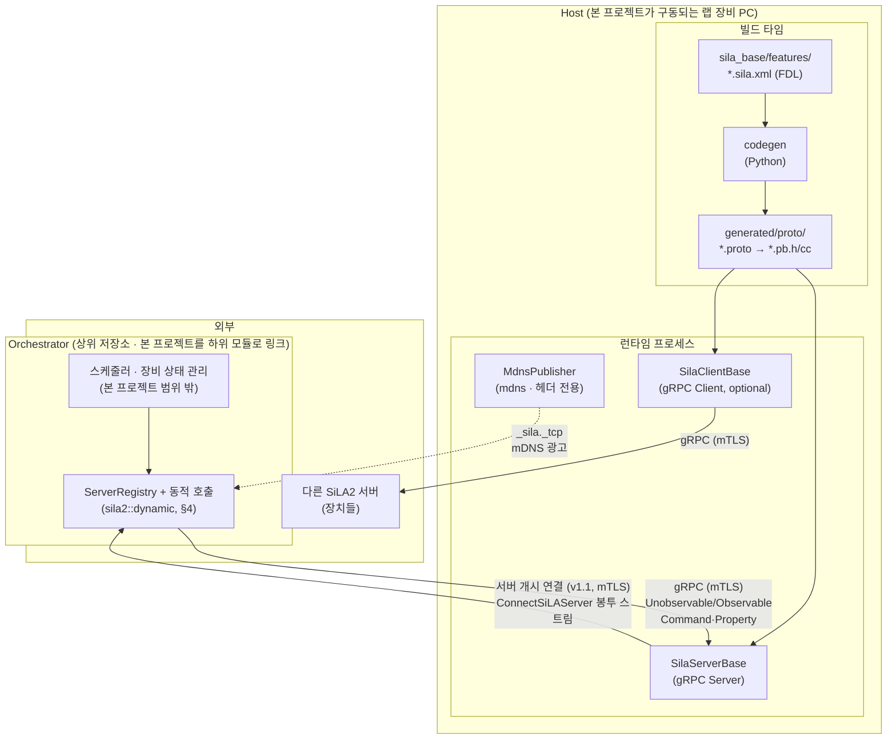

- **빌드 타임**: `sila_base` 서브모듈의 FDL(XML)을 파싱 후 `.proto`를 생성한 뒤, `protoc`/`grpc_cpp_plugin`으로 `generated/`에 C++ stub 생성.
- **런타임**: 생성된 stub을 기반으로 `src/sila/` 코어(서버 베이스, observable 커맨드 상태 머신, mDNS 퍼블리셔가 마운트. 장치 제어 로직(Feature 구현체)이 코어를 상속/조합하여 구현.

### 1.1 소비 형태 — 오케스트레이터의 하위 모듈

본 프로젝트는 실행 파일을 산출하지 않는 라이브러리로써, 랩 장비 제어 프로그램과 오케스트레이터 양쪽이 하위 모듈로 링크. 오케스트레이터는 빌드 시 FDL을 모르는 장비를 발견하여 제어하므로 동적 호출 경로(§4)를 요구, 장비 측은 서버 코어만 사용.
| 노출 타깃 | 내용 | 의존 |
|---|---|---|
| `sila2::core` | 서버 5축·트랜스포트 어댑터·타입 매핑·정적 stub 클라이언트·mDNS | gRPC, protobuf, mdns |
| `sila2::dynamic` | 런타임 FDL 파싱 → Descriptor 조립 → `GenericStub` 호출, `ServerRegistry`, `Any` 코덱 (§2.1, §4.2, §4.4) | `sila2::core` + pugixml |

- 소비 방식은 상위 저장소가 `add_subdirectory`로 직접 포함하거나 `install`/`export`한 패키지를 `find_package(sila2_cpp_foundation)`로 참조하는 두 가지. codegen 산출물(§2)은 FDL 집합이 소비자마다 다르므로 소비자 빌드 트리에 생성.
- 장비 측 빌드가 `sila2::dynamic`을 링크하지 않아 XML 파서와 descriptor 조립 코드가 빠지도록 타깃 분리. `Any` 해석도 descriptor 조립을 요구하므로(§2.1) `Any`를 값으로 다루는 장비는 예외적으로 dynamic을 링크.
- 스케줄링·워크플로·장비 상태 관리는 오케스트레이터 책임으로 이관, 본 저장소는 취소·연결·잠금·인증·에러 복구 다섯 훅만 제공 (§4.4). 인증·권한(§3.11)과 에러 복구(§3.12)는 코어가 토큰 보관·게시·대기 메커니즘까지, 자격증명 대조와 복구 절차 판정은 주입 인터페이스 너머로 분리 (§9.1).

## 2. 코드 생성 파이프라인 (빌드 타임)

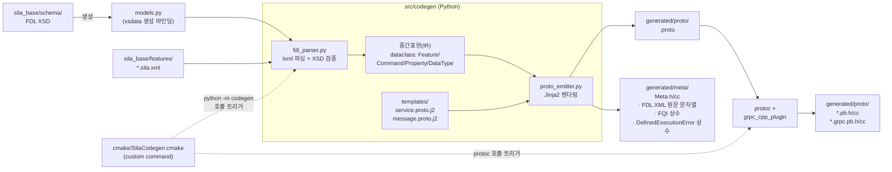

- `CMakeLists.txt`(최상위) → `cmake/SilaCodegen.cmake`가 각 `*.sila.xml`에 대해 `add_custom_command`으로 `python -m codegen` 추가 .
- FDL은 SiLA2의 커맨드/프로퍼티/데이터타입 정의로써, codegen이 FDL을 gRPC service/message로 1:1 변환.
- `SiLAFramework.proto`(sila_base 제공, 공통 타입: `String`, `Integer`, `ExecutionInfo`, `SiLAError`, `Binary` 등)의 모든 Feature `.proto`가 import됨.
- sila_base 레포 변경 이후, 스키마 불일치 시 fail-fast 시키기 위해 `xsdata` 이용, FDL XSD를 Python dataclass 필드로 변환. Codegen의 Parser는 IR 정규화만 담당 (sila_java: 같은 이유로 XSD → JAXB 바인딩 사용.)
- `SiLAService.GetFeatureDefinition`은 FDL XML을 원문 보존하여 반환. 이 과정 중 XML 원문을 문자열 상수로 담은 `<Feature>Meta.cc`를 함께 생성되어 바이너리에 임베드. 구현체에는 FQI(`org.silastandard/core/SiLAService/v1`)와 함께, 구현체가 에러를 던지게 하기 위해 FDL이 선언한 DefinedExecutionError 식별자 상수도 포함시킴.
- codegen로부터 생성된 RPC는 각 Feature마다 커맨드/프로퍼티 외 다음이 기계적으로 파생:
  - Observable Command → `<Cmd>`(UUID 반환) · `<Cmd>_Info`(streaming) · `<Cmd>_Result` · (정의된 경우) `<Cmd>_Intermediate`
  - Observable Property → `Subscribe_<Prop>`(streaming)
  - Unobservable Property → `Get_<Prop>`
  - Feature가 참조하는 Metadata마다 → `Get_FCPAffectedByMetadata_<Metadata>`
- 빌드 타임 매핑과 런타임 매핑의 등가성을 고정하는 기준으로써, codegen이 `.proto`·`<Feature>Meta`와 함께 `protoc --descriptor_set_out`으로 `FileDescriptorSet`(`generated/descriptor/<Feature>.desc`)도 산출 (§4.3).
- 산출물은 전량 `.gitignore` 대상 — 소스는 FDL + 템플릿 + 파서 코드, `.proto`/`.pb.*`/`*Meta.*`는 재현 가능한 빌드 아티팩트.

### 2.1 데이터 타입 매핑 경계

FDL 타입 → proto 메시지 변환은 codegen이 담당, 런타임 시 직렬화·역직렬화 코드는 코어(src/sila/types/)에 포함.
- Basic 타입(`String`/`Integer`/`Real`/`Boolean`/`Date`/`Time`/`Timestamp`/`Binary`/`Any`)은 각각 `SiLAFramework` 메시지로 감싸져 있어 C++ 네이티브 타입과의 양방향 변환 wrapper 필요.
- 런타임에 타입 정보를 들고 다녀야 하므로, `Any`는 값과 타입 정의 XML을 함께 포함. `SiLAFramework.Any`의 `payload`는 값 자체가 아니라 타입 정의로부터 런타임에 조립한 익명 Structure 메시지의 직렬화 결과이므로, 읽기·쓰기 양방향 모두 XML 파싱을 넘어 descriptor 조립(§4.2)을 요구 — sila_java `SiLAAny`가 `ProtoMapper.dataTypeToDescriptor`를 타는 구조와 동일.
- 따라서 `Any` 코덱은 `sila2::dynamic`에 배치, core의 `AnyValue`는 타입 XML과 payload를 불투명하게 보관·전달만 수행(§1.1). `Void`에 해당하는 `Any` 상수(`Length=0` String 제약)는 직렬화 결과를 상수로 임베드하여 core만으로 제공.
- `Binary`는 크기에 따라 두 경로로 갈림 (§3.5).
- FDL Constraint(`MaximalLength`, `Pattern`, `Unit` 등)는 proto로 표현되지 않음. codegen은 "이 제약이 이 타입에 적법한 지" 검증, 런타임 값은 서버쪽에서 검증 (§3.4의 ValidationError).

## 3. 런타임 서버 구조

서버 코어는 인터셉터 체인 조립기 + 5개 축의 런타임 서비스, 서로 독립적인 각 축은 Feature 구현체가 필요에 따라 조합해서 사용.
| 축 | 담당 | 주 컴포넌트 |
|---|---|---|
| ① Feature dispatch | FQI 기반 서비스 등록/조회, SiLAService core feature | `FeatureRegistry`, `SiLAServiceImpl` |
| ② Observable Command | UUID 발급·상태머신·수명 관리 | `ObservableCommandManager`, `ObservableCommand` |
| ③ Observable Property | 구독자 집합 관리·값 변경 브로드캐스트 | `ObservablePropertyManager` |
| ④ Error | SiLAError 4종 ↔ gRPC Status details | `SiLAError`, `SiLAErrorException` |
| ⑤ Binary Transfer | 2 MiB 초과 Binary의 청크 업/다운로드 + 저장소 | `BinaryStore`, `BinaryUploadService`, `BinaryDownloadService` |

Client Metadata는 여기에 횡단 관심사(Cross-Cutting Concerns)로 추가. 인터셉터 체인은 이 Client Metadata를 전달, 인증·권한 축(§3.11)은 이를 기반으로 동작, 에러 복구 축(§3.12)은 ②에 마운트. 다섯 축 모두 트랜스포트와 분리하여 클래식 연결과 서버 개시 연결 양쪽에서 같은 구현체가 동작(§3.8, §3.9).
### 3.1 전체 조립도

```mermaid
flowchart TB
    Client(["SiLA Client"])

    subgraph Process["SiLA Server 프로세스"]
        direction TB

        subgraph Boot["부팅/구성 (요청 경로 밖)"]
            CFG["ServerConfig<br/>UUID·Name 영속화<br/>(재시작 후에도 동일 UUID)"]
            TLS["TlsConfig<br/>인증서 로드 / 자체서명 생성"]
            MDNS["MdnsPublisher<br/>_sila._tcp 광고 + 질의 응답 스레드"]
        end

        subgraph TP["트랜스포트 어댑터 (§3.8)"]
            direction TB
            TG["GrpcTransport<br/>생성된 grpc::Service<br/>ServerContext → CallContext"]
            TC["CloudTransport (§3.9)<br/>ConnectSiLAServer 봉투 스트림<br/>CloudEnvelopeRouter · ActiveCallRegistry"]
        end

        subgraph Chain["인터셉터 체인 (모든 호출이 통과)"]
            direction TB
            I1["MetadataExtractingInterceptor<br/>SiLA Client Metadata를<br/>CallContext에 부착"]
            IA["AuthorizationInterceptor (§3.11)<br/>AccessToken 대조 · lock identifier 검사"]
            I2["BinaryParameterInterceptor<br/>BinaryTransferUUID → 실제 값 해석"]
            I3["ErrorTransmitInterceptor<br/>미포착 예외 → UndefinedExecutionError"]
            I1 --> IA --> I2 --> I3
        end

        FR["① FeatureRegistry<br/>FQI(버전 포함) → (SilaHandler 테이블, FDL XML)"]

        CoreFeat["SiLAServiceImpl<br/>GetFeatureDefinition / ListImplementedFeatures<br/>ServerName·UUID·Type·Version"]

        CCS["ConnectionConfigurationServiceImpl (§3.9)<br/>Enable/Disable ServerInitiatedConnectionMode<br/>Connect/DisconnectSiLAClient"]

        subgraph Auth["인증·권한 (§3.11)"]
            AUTH["AuthenticationServiceImpl<br/>AuthorizationServiceImpl<br/>AuthorizationConfigurationServiceImpl"]
            ATS["AuthTokenStore<br/>토큰 → 만료 시각·허용 FQI 집합<br/>+ 만료 GC"]
            POL["CredentialVerifier · AccessPolicy<br/>(사이트가 주입)"]
            AUTH --> ATS
            AUTH --> POL
        end

        subgraph ErrRec["에러 복구 (§3.12)"]
            ERS["ErrorRecoveryServiceImpl"]
            ERG["RecoverableErrorGate<br/>CommandExecutionUUID →<br/>게시된 에러 · 대기 스레드 · 타이머 2종"]
            ERS --> ERG
        end

        subgraph Features["Feature 구현체들"]
            F1["FeatureAImpl<br/>(생성된 SilaHandler 베이스 상속)"]
            F2["FeatureBImpl"]
        end

        OCM["② ObservableCommandManager<br/>UUID → ObservableCommand<br/>+ lifetime GC 스케줄러"]
        OPM["③ ObservablePropertyManager<br/>프로퍼티별 구독자 집합"]
        ERR["④ SiLAError<br/>Validation / DefinedExecution<br/>UndefinedExecution / Framework"]

        subgraph Bin["⑤ Binary Transfer (별도 gRPC 서비스)"]
            BUP["BinaryUploadService"]
            BDL["BinaryDownloadService"]
            BST["BinaryStore<br/>UUID → 청크, 수명 관리"]
            BUP --> BST
            BDL --> BST
        end

        SSB["SilaServerBase<br/>체인 조립 · 서비스 등록 · lifecycle"]

        SSB --> TP
        TP --> Chain
        SSB --> FR
        SSB --> CCS
        CCS -. "클라이언트 등록·연결 제어" .-> TC
        CFG -. "Persist=true 클라이언트 목록" .-> TC
        SSB --> Bin
        SSB --> Auth
        SSB --> ErrRec
        SSB --> CFG
        SSB --> TLS
        SSB -.광고 트리거.-> MDNS
        CFG -. "UUID/Name 공급" .-> CoreFeat
        CFG -. "TXT 레코드" .-> MDNS

        Chain --> CoreFeat
        Chain --> CCS
        Chain --> AUTH
        Chain --> ERS
        Chain --> F1
        Chain --> F2
        FR --> CoreFeat
        FR --> AUTH
        FR --> ERS
        FR --> F1
        FR --> F2
        IA -. 조회 .-> ATS
        CFG -. "AuthorizationProvider UUID" .-> AUTH

        F1 --> OCM
        F1 --> OPM
        F1 -. throw .-> ERR
        F1 -. "복구 가능 에러 게시 후 대기" .-> ERG
        F2 --> OCM
        I2 -. 조회 .-> BST
        ERG --> OPM
    end

    Prov(["AuthorizationProvider 서버<br/>(설정된 UUID가 자기 자신이 아닌 경우)"])
    ATS == "AuthorizationProviderService.Verify<br/>(클라이언트 축 경유)" ==> Prov

    Client == "모든 Feature RPC<br/>(+ 헤더에 Client Metadata)" ==> TG
    Client == "BinaryUpload / BinaryDownload<br/>(청크 스트리밍)" ==> Bin
    TC == "역접속 후 봉투 스트림<br/>(서버 개시 연결)" ==> Client
```

### 3.2 ① Feature dispatch — FeatureRegistry

- FQI(`org.silastandard/core/LockController/v1`)를 key로, 같은 Feature의 v1/v2 버젼이 동시 등록 가능해야 함 — sila_java도 `LockController` v1·v2를 함께 보유.
- `(SilaHandler 테이블, FDL XML 원문)` 을 key에 대한 value로, XML은 codegen이 `<Feature>Meta.cc`로 임베드한 문자열 상수(§2)를 참조함. 핸들러 테이블을 트랜스포트 어댑터 양쪽이 공유(§3.8), `grpc::Service` 인스턴스는 gRPC 어댑터만 보유.
- core feature가 registry에 의존하는 구조로, `SiLAServiceImpl`은 registry를 조회하여 `ListImplementedFeatures`/`GetFeatureDefinition`에 응답.
- `SilaServerBase`는 빌더로써 Feature 구현체를 조합하여 등록:
  `SilaServerBase::Builder().WithConfig(...).AddFeature(kFeatureAFqi, &impl_a).WithBinaryTransfer().Build()`

### 3.3 ②③ Observable Command / Property

**② Observable Command** — 요청 단위로 인스턴스 생성 후, 클라이언트가 결과를 수거하기 전까지 서버가 상태를 보관.

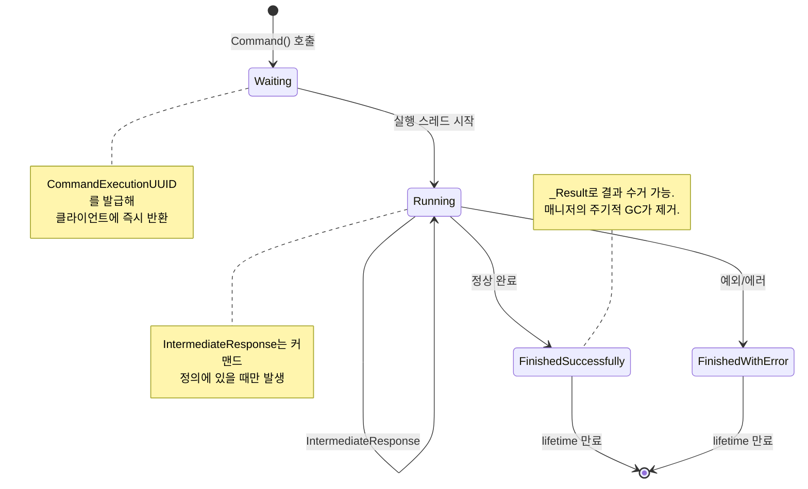

| 전이 | 트리거 | 비고 |
|---|---|---|
| `[*] → Waiting` | `Command()` unary 호출 | `CommandExecutionUUID` 즉시 반환 |
| `Waiting → Running` | 실행 스레드 시작 | |
| `Running → Running` | `IntermediateResponse` | 커맨드 정의가 있을 시 |
| `Running → FinishedSuccessfully` | 정상 완료 | `_Result` 반환 가능 |
| `Running → FinishedWithError` | 예외/에러 | `_Info` 스트림으로 에러 전달 |
| `Finished* → [*]` | lifetime 만료 | GC가 제거 (§아래) |

- `ObservableCommandManager`가 `UUID → ObservableCommand` 맵을 소유, 클라이언트가 결과를 영원히 가져가지 않는 경우 또한 정상 시나리오이므로 수명 만료는 매니저의 주기적 GC가 수행. `removeExpired()`는 GC 스레드가 호출하는 동일 메서드를 공개 API로도 노출하여, GC 주기를 기다리지 않고 호출자가 즉시 만료 항목을 정리할 수 있게 함. lifetime이 `null`이면 수동 제거 전까지 유지(sila_java `ObservableCommandManager`와 동일 정책).
- 알 수 없는 UUID로 `_Info`/`_Result` 호출 시 `FrameworkError{INVALID_COMMAND_EXECUTION_UUID}` (§3.4 "④ 에러 축 = 코어 자료구조" 참조)
- 상태 다이어그램에 없는 전이(예: `FinishedSuccessfully`에서 `start()` 재호출)는 프로그래밍 오류이므로 `std::logic_error`로 즉시 실패 — 복구 불가능한 호출자 버그를 런타임 에러로 묻지 않고 드러냄.
- `_Info` 스트림이 취소된 경우, `ObservableCommand`가 취소 요청 플래그와 취소 콜백을 노출하여 Feature 구현체의 실행 스레드 정리 근거로 사용 — SiLA 2에 커맨드 취소 RPC가 없어 스트림 절단이 유일한 취소 신호. 취소 이후의 재시도·재스케줄 판단은 오케스트레이터 몫(§4.4).
- 서버 종료 시 `ObservableCommandManager::interruptAll()`이 활성 실행 전체에 중단을 요청하여, 개별 스트림 취소에 의존하지 않고 매니저 수준에서 일괄 정리.

**③ Observable Property** — 구독자 집합.

- `Subscribe_<Prop>`는 구독 시, 그리고 이후 값 변경 시에만 push.
- `ObservablePropertyManager`는 프로퍼티별 구독자 리스트 + 연결 종료/취소 시 정리를 담당.
- 느린 구독자 백프레셔는 구독별 유한 큐 — 깊이는 `ServerConfig`(§3.7) 설정값(기본 16), 초과 시 가장 오래된 값부터 폐기하고 값 변경 측 스레드는 막지 않음. 프로퍼티는 상태이지 이벤트 로그가 아니므로 중간 값 폐기가 구독자를 최신 값에서 멀어지게 하지 않음, 큐를 두는 목적은 짧은 지연 흡수. `ExecutionInfo`(`_Info`) 스트림도 진행 상태이므로 같은 큐 정책.
- `IntermediateResponse`는 값마다 의미가 있어 폐기 대상에서 제외, 같은 깊이의 큐가 찬 경우 그 구독을 `FrameworkError`(§3.4)로 종료하여 클라이언트가 유실을 인지하게 함.
### 3.4 ④ 에러 모델

SiLA 에러는 gRPC `Status`의 details에 `SiLAError` 메시지로 직렬화되어 나갈 때, 각기 다른 지점에서 4종이 발생:
| 종류 | 언제 | 발생 주체 |
|---|---|---|
| `ValidationError` | 파라미터가 FDL Constraint 위반 | Feature 구현체 (FQI 파라미터 식별자 첨부 필수) |
| `DefinedExecutionError` | FDL에 선언된 에러 발생 | Feature 구현체 (codegen이 emit한 FQI 상수 사용) |
| `UndefinedExecutionError` | 예상 못 한 예외 | `ErrorTransmitInterceptor`가 자동 변환 |
| `FrameworkError` | 잘못된 UUID, 미지원 메타데이터 등 | 코어 (`ObservableCommandManager`, 인터셉터) |

- `SiLAErrorException`(gRPC status로 변환 가능한 C++ 예외 타입)을 Feature 구현체가 던지면 인터셉터가 그 외 모든 예외를 `UndefinedExecutionError`로 wrap하여 gRPC 타입 예외처리.
- Constraint 런타임 검증은 코어가 값 의미를 몰라 못하지만 (§2.1), codegen이 Constraint 정보를 `<Feature>Meta`에 실어주므로써 공용 검사 헬퍼(`src/sila/types/constraints.h`)로 상당 부분 정적 처리 가능.

### 3.5 ⑤ Binary Transfer

FDL `Binary` 타입은 크기에 따라 두 경로로 분기, 큰 쪽만 별도 gRPC 서비스로 처리.

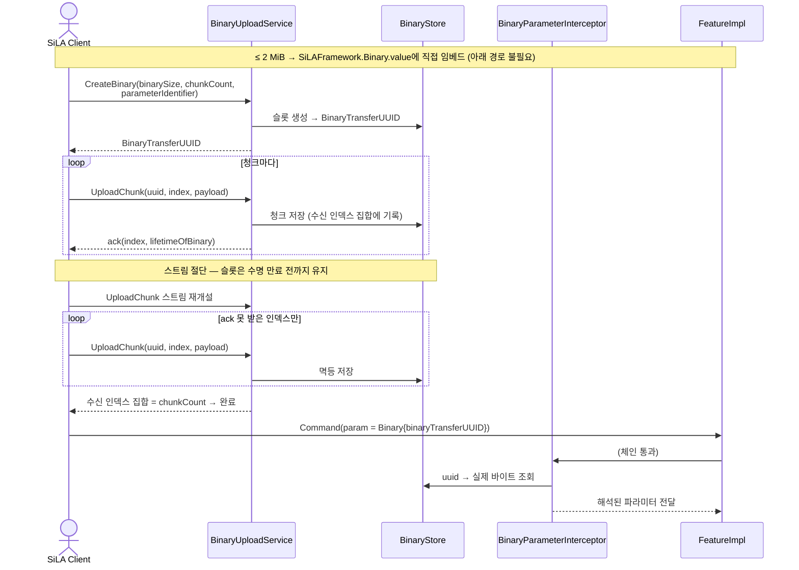

- `BinaryStore`는 UUID별 청크 자체, 수신 청크 인덱스 집합, 미완료/미수거 바이너리의 만료 시각을 서버 상태로 들고 있어야 하므로, 수명 만료 GC가 필요.
- 저장 백엔드는 인터페이스 하나에 구현 둘 — 인메모리와 파일 스풀. `CreateBinary`가 선언한 `binarySize`가 `ServerConfig`(§3.7) 임계값을 넘긴 경우 해당 UUID의 청크를 임시 디렉터리 파일에 기록, 이미징 장비의 수백 MB 결과가 RAM에 상주하는 것을 막음. 수명 만료 GC와 프로세스 종료가 파일도 함께 삭제.
- 완료 판정은 수신 인덱스 집합이 `chunkCount`를 채운 시점. 순서 없이 도착하는 청크를 받아들이는 근거이자, 스트림 절단 후 재접속한 클라이언트가 남은 인덱스만 이어 올리는 근거.
- 청크 저장은 `UploadChunkResponse` 유실 뒤의 재전송과 중복 전송을 구분할 수단이 없어 멱등 연산으로 정의, 같은 인덱스가 다시 도착한 경우 덮어쓴 후 다시 ack.
- 서버의 수신 청크 집합을 묻는 RPC는 스펙에 없음(`GetBinaryInfo`는 다운로드 쪽 크기·수명만 반환). 재개 시 무엇을 다시 보낼지는 클라이언트가 ack 받은 인덱스 기억으로 판정(§4.6), 서버는 멱등 저장으로 중복을 흡수.
- 수명은 `CreateBinaryResponse.lifetimeOfBinary`로 통지 후 `UploadChunkResponse`마다 갱신. 스트림 절단은 슬롯을 버리는 사건이 아니고 수명 만료 GC만 제거하며, 만료 후 재개 시도는 `BinaryTransferError{INVALID_BINARY_TRANSFER_UUID}`로 응답하여 클라이언트가 `CreateBinary`부터 다시 시작.
- 다운로드 재개는 `GetChunk`가 (offset, length) 지정이므로 서버 상태 없이 성립, 클라이언트가 마지막 수신 offset부터 다시 요청.
- 서버 개시 연결(§3.9)의 봉투 경로도 같은 저장소·같은 멱등 규칙, 스트림 절단 시 `CloudTransport` 재연결 후 남은 청크를 이어 올림.
- 두 구현 모두 프로세스 재시작을 건너는 내구성은 제공하지 않음. 재시작 시 `ObservableCommandManager`의 UUID 맵(§3.3)이 사라져 그 바이너리를 참조할 커맨드가 남지 않으므로 바이너리만 보존할 실익이 없음, sila_java `BinaryDatabase` + H2가 택한 영속 백엔드는 비목표(§9.1).
- 업로드 시 클라이언트는 어느 커맨드와 파라미터에 쓸 바이너리인지 FQI로 선언, 서버는 이를 화이트리스트로 검증(허용되지 않은 파라미터로의 업로드 거부).
- 다운로드는 역방향: Feature가 큰 결과를 `BinaryStore`에 넣고 `BinaryTransferUUID`만 반환 시, 클라이언트가 `BinaryDownloadService`로 청크를 받아감.
- codegen은 `Binary` 파라미터에 대해 두 경로를 모두 표현하는 메시지를 emit (값 직접 vs UUID 참조 — `SiLAFramework.Binary`의 oneof).

### 3.6 횡단 관심사 — Client Metadata

- 클라이언트는 SiLA Client Metadata를 gRPC 헤더에 바이너리로 실어 보냄. 헤더 키는 메타데이터 FQI에서 파생.
- 어떤 메타데이터 타입인지는 해당 Feature만 알므로, `MetadataExtractingInterceptor`는 체인 최상단에서 헤더를 걷어 `CallContext`에 부착, 파싱은 Feature 구현체 몫.
- Feature 구현체는 `CallContext`에서 자기 관심 메타데이터를 꺼내 해석.
- 각 Feature는 codegen이 자동 생성하는 `Get_FCPAffectedByMetadata_<Metadata>` RPC로 "이 메타데이터가 어떤 커맨드/프로퍼티에 영향을 주는지" 답해야 함(§2).
- 이 메타데이터 축을 기반으로 하는 core feature는 `LockController`(§3.10)와 `AuthorizationService`(§3.11), 둘 다 코어가 구현체까지 제공.

### 3.7 부팅/구성

- **`ServerConfig`**: 클라이언트가 UUID로 서버를 식별해 바인딩하므로 Server UUID와 Name은 재시작 후에도 동일해야함, 영속(파일) 구현과 비영속(테스트용) 구현은 인터페이스로 분리. UUID는 최초 부팅 시 1회 생성 후 저장.
- **`TlsConfig`**: SiLA2는 TLS를 요구, 자체서명 인증서를 허용 — 인증서가 없으면 생성, 있으면 로드. 생성한 인증서는 `ServerConfig`와 같은 위치에 영속.
- **`MdnsPublisher`**: 데몬을 경유하지 않고 프로세스가 5353 멀티캐스트 소켓을 직접 보유(§6). mDNS 인스턴스 이름은 `ServerName`, TXT 레코드에 `ServerConfig`의 UUID와 SiLA 버전을 실음. `SiLAService.SetServerName`이 이름을 런타임에 바꾸므로 인스턴스 이름은 재시작 후 동일할 필요가 없고, 클라이언트 재바인딩 근거는 TXT의 UUID.
- 런타임 조정값도 `ServerConfig`가 보유: 구독별 큐 깊이(기본 16, §3.3), `BinaryStore` 파일 스풀 임계 크기와 슬롯 수명(§3.5), 서버 개시 연결의 write 임계 시간(§3.9), `AuthorizationProvider` UUID(§3.11), 기본 에러 핸들링 타임아웃(§3.12), mDNS 재광고 주기·레코드 TTL·프로브 응답 대기 시간(§6).
- access token(§3.11)은 자격증명 파생물을 평문으로 디스크에 남기지 않기 위해 영속 대상에서 제외, 재시작 후 복구 비용은 `Login` 1회.

### 3.8 트랜스포트 추상화 — `CallContext` / `ResponseSink`

Feature 구현체는 클래식 연결과 서버 개시 연결(§3.9) 양쪽에서 같은 코드로 불려야 하므로, 코어가 노출하는 핸들러 시그니처에서 `grpc::ServerContext*`를 제거하고 트랜스포트 중립 타입만 노출. 다섯 축이 두 모드에서 타는 통로:
| 축 | 클래식 gRPC | 서버 개시 연결 봉투 |
|---|---|---|
| 페이로드 | 생성된 타입 메시지 | `bytes parameters` / `bytes response` |
| 메타데이터 | HTTP/2 헤더 | 봉투 안 `repeated Metadata` |
| 에러 | `Status` details | `oneof`의 `commandError` / `propertyError` |
| 구독 취소 | RPC 취소 감지 | `CancelObservablePropertySubscription` 등 명시 메시지 |
| Binary Transfer | 별도 gRPC 서비스 | 같은 봉투의 `CreateBinaryUploadRequest` 등 |

- **`CallContext`**(§3.6): 메타데이터 조회, 취소 신호(`is_cancelled()`), deadline을 담는 호출 문맥. 트랜스포트별 어댑터가 채움 — gRPC 어댑터는 `grpc::ServerContext`에서, 클라우드 어댑터는 봉투 필드에서.
- **`ResponseSink<T>`**: `Send`/`Finish`/`Fail` 세 연산. Unobservable은 1회 `Send` 후 `Finish`, 스트리밍은 `Send` 반복.
- **`SilaHandler`**: `void(const Req&, CallContext&, ResponseSink<Resp>&)`. 생성된 gRPC 서비스 베이스와 클라우드 라우터가 각자 이 시그니처로 위임하는 얇은 어댑터.
- 인터셉터 체인(§3.1)은 `grpc::ServerContext` 대신 `CallContext` 위에서 동작, 트랜스포트별 어댑터를 체인 앞단에 배치.
- `SiLAErrorException` → `SiLAError` 변환(§3.4)은 두 모드가 공유, `Status` details 직렬화와 봉투 `commandError` 필드 적재만 각 어댑터가 분담.
- `ObservablePropertyManager`(§3.3)의 구독자를 `ResponseSink` 집합으로 표현하여 브로드캐스트 경로를 트랜스포트와 분리, `grpc::ServerWriter` 직접 보유 금지.
- codegen은 `<Feature>Meta`에 FQI → 핸들러·파서·시리얼라이저 테이블을 emit. 서버 측 디스패치는 컴파일 타임에 Feature 집합이 확정되어, 클라이언트의 런타임 디스크립터 축(§4.2)과는 별개로 정적 함수 테이블로 충분.

gRPC-Java는 이 이음매(seam)를 기본 제공하기에 sila_java `library/cloudier`가 코어를 건드리지 않는 리프 모듈로 존재 — 생성 시그니처 `void spin(SpinRequest, StreamObserver<SpinResponse>)`가 트랜스포트 객체를 받지 않아 `CloudCallForwarder`가 구현체를 gRPC 스택 경유 없이 직접 호출하고, 메타데이터는 `io.grpc.Context`로 전달. gRPC-C++에는 둘 다 없어 위 타입들을 직접 만들어야 함.

### 3.9 서버 개시 연결 (Server-Initiated Connection, SiLA 2 v1.1)

`ConnectionConfigurationService-v1_1` FDL을 구현하는 서버가 제공하는 모드로써, 서버가 SiLA Client의 `CloudClientEndpoint.ConnectSiLAServer`(`SiLACloudConnector.proto`)로 역접속 후 단일 양방향 스트림 위에서 모든 호출을 `requestUUID`로 다중화. 방화벽·NAT 뒤의 장비를 원격 오케스트레이터가 제어하는 경우가 대상, mDNS 광고(§6)는 이 모드에서 불필요.

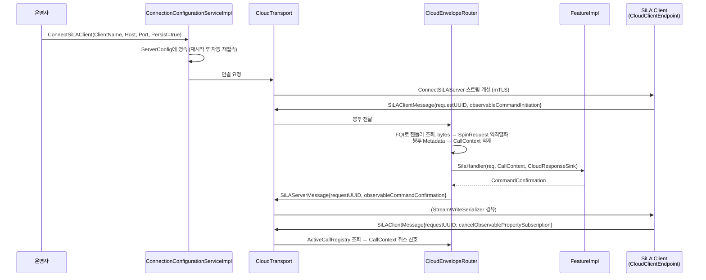
- **`CloudTransport`**(`src/sila/transport/cloud/`): 설정된 클라이언트마다 스트림 하나를 개설·유지, 절단 시 지수 백오프 재연결.
- **`CloudEnvelopeRouter`**: `SiLAClientMessage`의 `oneof` 케이스와 `fullyQualifiedCommandId`·`fullyQualifiedPropertyId`로 핸들러를 조회, `<Feature>Meta` 파서 테이블(§3.8)로 `bytes`를 역직렬화한 뒤 `CallContext`에 봉투 `Metadata`를 실어 호출.
- **`CloudResponseSink`**: 핸들러 응답을 해당 `oneof` 케이스의 `SiLAServerMessage`로 감싸고 `requestUUID`를 부착하여 전송.
- **`StreamWriteSerializer`**: 여러 구독이 한 스트림에 동시 write하므로 뮤텍스로 보호되는 writer 래퍼(sila_java `SynchronizedStreamObserver` 대응).
- 백프레셔는 §3.3의 구독별 큐가 이 writer 앞단에서 흡수, 큐가 구독 단위로 분리되어 느린 구독 하나가 다른 구독의 값을 밀어내지 않음. 스트림 전체가 정체되는 경우는 클라이언트가 수신을 멈춘 연결 단위 장애로 좁혀지므로, 미완료 write가 임계 시간을 넘긴 경우 해당 연결을 끊고 `CloudTransport`의 지수 백오프 재연결에 맡김.
- **`ActiveCallRegistry`**: `requestUUID` → 진행 중 호출 맵. `Cancel*` 메시지 수신 시 해당 `CallContext`의 취소 신호를 발동, 스트림 절단 시 전 항목 일괄 해제. C++은 GC가 없어 호출 객체를 `shared_ptr`로 소유하고 레지스트리는 `weak_ptr`로 조회 — sila_java가 `// todo map thread safe`, `// todo check race condition`으로 남겨둔 지점.
- **`ConnectionConfigurationServiceImpl`**: `EnableServerInitiatedConnectionMode`·`DisableServerInitiatedConnectionMode`·`ConnectSiLAClient`·`DisconnectSiLAClient` 4개 커맨드와 `ServerInitiatedConnectionModeStatus`·`ConfiguredSiLAClients` 2개 프로퍼티. 미등록 `ClientName` 지정 시 `InvalidSiLAClient` DefinedExecutionError(§3.4).
- 영속: FDL Description이 재시작 후 자동 재접속을 요구하므로, `Persist=true` 클라이언트 목록과 모드 활성 상태를 `ServerConfig`(§3.7)에 저장.
- Binary Transfer(§3.5)는 `BinaryStore`를 그대로 재사용, 봉투 내 `CreateBinaryUploadRequest` 등을 기존 서비스 구현으로 넘기는 어댑터만 추가.

### 3.10 코어가 제공하는 core feature

코어가 구현체까지 갖는 core feature는 여덟 — `SiLAService`(§3.2), `ConnectionConfigurationService`(§3.9), `SimulationController`, `LockController`, 인증·권한 3종(§3.11), `ErrorRecoveryService`(§3.12). 모두 장비 종류와 무관한 범용 로직이라 장비마다 다시 만들 이유가 없음, 아래 둘은 이 절에서, 뒤의 넷은 별도 절에서 서술.
- `SimulationController`: 코어가 `SimulationMode` 프로퍼티와 `StartSimulationMode`·`StartRealMode` 커맨드를 보유, Feature 구현체는 `FeatureRegistry`(§3.2)로 현재 모드를 질의. 전환 요청 시 코어가 등록된 구현체들에 전환 가능 여부를 물어 하나라도 거부한 경우 `StartSimulationModeFailed`·`StartRealModeFailed` DefinedExecutionError(§3.4) 반환, 시뮬레이션 모드에서 어떤 값을 낼지는 구현체 몫.
- `LockController`: `LockServer`·`UnlockServer` 커맨드와 `IsLocked` 프로퍼티, 클라이언트가 제시한 lock identifier의 보관과 타임아웃 만료를 코어가 관리. 검증은 메타데이터 축(§3.6) 위에서 수행 — `MetadataExtractingInterceptor` 뒤, `FeatureRegistry` dispatch 앞에 잠금 상태와 요청 lock identifier를 대조하는 검사를 두고 불일치 시 `ServerNotLocked`·`InvalidLockIdentifier` 반환. Feature 구현체가 관여하지 않는 메타데이터 소비처로써, 같은 자리에서 `AuthorizationService`(§3.11)의 토큰 검사와 나란히 동작.
- 클라이언트 축의 lock identifier 자동 부착(§4.4)과 짝을 이루어, `tests/interop`(§7)이 C++ 서버·클라이언트만으로 잠금 시나리오를 검증 가능.

### 3.11 인증·권한 — `AuthenticationService` · `AuthorizationService` · `AuthorizationConfigurationService`

토큰 발급·호출별 검증·검증 위임 대상 지정 세 역할을 core feature 셋이 나눠 가짐. 코어는 세 구현체와 토큰 저장소·검증 지점까지 보유, 자격증명 대조와 FQI별 허용 판정은 사이트가 주입하는 인터페이스 뒤에 둠 (§9.1).

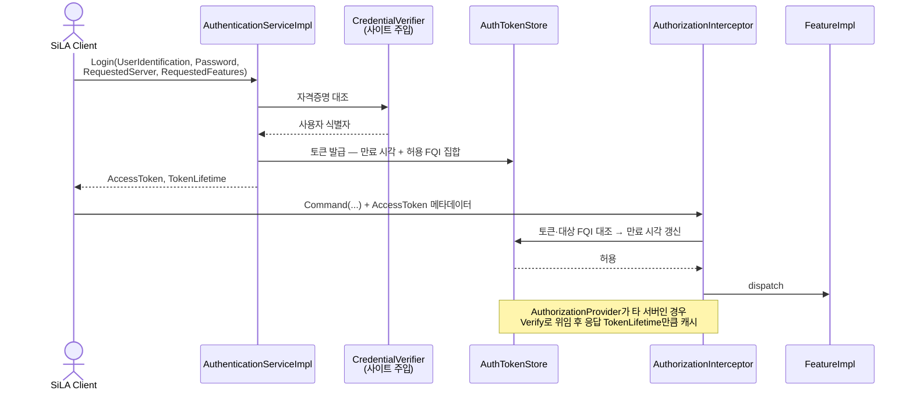

- `AuthTokenStore`: 토큰 → (만료 시각, 허용 FQI 집합, 사용자 식별자). FDL이 `TokenLifetime`을 "마지막 서버 요청 이후의 최대 유효 기간"으로 정의하므로 검증 성공 시마다 만료 시각을 늦추는 슬라이딩 만료, 만료 항목 제거는 `ObservableCommandManager`(§3.3)·`BinaryStore`(§3.5)와 같은 주기 GC.
- 주입 인터페이스는 둘. `CredentialVerifier`가 (사용자 식별자, 패스워드) → 사용자 식별 결과를, `AccessPolicy`가 (사용자, FQI) → 허용 여부를 판정. `SilaServerBase::Builder`(§3.2)가 인증 축 등록 시 둘을 필수 인자로 요구, 코어는 기본 구현을 두지 않기에 코어 밖에서 LDAP 혹은 설정 파일로 구현.
- 검증 지점은 `FeatureRegistry` dispatch와`AuthorizationInterceptor`, `MetadataExtractingInterceptor` 사이로 `LockController`(§3.10) 검사와 같은 자리. `AccessToken` 메타데이터를 꺼내 대조 후 실패 시 `InvalidAccessToken` DefinedExecutionError(§3.4) 반환, 보호 대상 FQI를 메타데이터 없이 호출한 경우도 같은 에러.
- 보호 대상 집합은 `AccessPolicy`가 선언, `Get_FCPAffectedByMetadata_AccessToken`(§2)이 그 집합을 그대로 반환.
- `Login`의 `RequestedServer`는 자기 Server UUID(§3.7)와 대조하여 불일치 시 `ValidationError`(§3.4), `RequestedFeatures`는 발급 토큰의 허용 FQI 집합, 비어 있는 경우 `AccessPolicy`가 그 사용자에게 허용하는 전체.
- 검증 위임: `AuthorizationConfigurationService`의 `AuthorizationProvider`가 자기 UUID인 경우 로컬 `AuthTokenStore`, 다른 UUID인 경우 그 서버의 `AuthorizationProviderService.Verify`를 클라이언트 축(§4)으로 호출. 서버 코어가 클라이언트 코어를 소비하는 유일한 지점으로써, `sila2::core`가 정적 stub 클라이언트를 이미 포함하므로(§1.1) 새 의존은 붙지 않음.
- 캐시 자료구조는 로컬 발급 토큰과 같은 `AuthTokenStore`로써, 원격 검증을 호출마다 왕복시키지 않기 위해 `Verify` 응답의 `TokenLifetime`으로 항목을 채운 후 그 기간 재사용. `SetAuthorizationProvider`가 "다음 요청부터"를 요구하므로 provider 교체 시 캐시 전량 폐기.
- provider 주소 해석은 `ServerRegistry`(§4.4)의 UUID → 주소 매핑. provider가 미발견이거나 연결 불가인 경우 `UndefinedExecutionError`(§3.4)로 호출을 거부하는 fail-closed.
- 서버 개시 연결(§3.9)에서도 같은 인터셉터가 동작, 헤더 자리를 봉투의 `Metadata`가 대신함(§3.8). 위임 호출은 봉투와 무관한 별도 채널로 처리.
- sila_java는 이 축을 라이브러리 밖에 둠 — `library/server_base`의 `AuthorizationController`가 FQI 하나를 받는 `Authorize` 함수형 인터페이스와 에러 식별자 상수만 노출, 토큰 저장소(`AuthTokens`)와 `Login` 구현은 `interoperability/server` 데모에 있음. 본 프로젝트는 저장소·인터셉터·위임까지 코어가 갖고 주입 인터페이스만 사이트로 남기는 쪽으로 경계를 옮김.

### 3.12 에러 복구 — `ErrorRecoveryService`

실행 중인 observable command가 복구 가능한 에러를 만난 경우, 서버가 에러와 계속 옵션 목록을 게시한 후 클라이언트의 선택을 기다림. sila_base가 v1.0과 v2.0을 함께 보유하므로 `FeatureRegistry`의 다중 버전 등록(§3.2)으로 둘 다 노출, 대기 상한 만료 후 거동이 v1.0의 "서버 내부 에러 상태 진입"에서 v2.0의 "해당 에러만 제거 후 일반 SiLA 에러"로 바뀜.

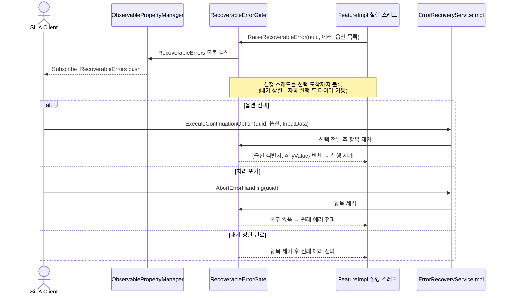

- `RecoverableErrorGate`: `CommandExecutionUUID` → (게시된 `RecoverableError`, 대기 중 실행 스레드, 타이머 2종). Feature 구현체의 실행 스레드가 `CallContext`의 `RaiseRecoverableError(...)`로 블록, 코어가 목록에 항목을 추가한 뒤 선택 도착까지 대기.
- 코어가 담당하는 것은 게시·대기·전달. 어떤 continuation option을 낼지와 선택된 옵션으로 무엇을 할지는 반환값을 받은 구현체 몫으로, 복구 절차 판정이 클라이언트와 구현체 양쪽에 남으므로 오케스트레이션 로직을 코어에 들이지 않는 경계(§1.1) 유지.
- `RecoverableErrors`는 Observable Property로써 ③ 축(§3.3)에 그대로 마운트. 목록 전체를 값으로 push하는 상태 프로퍼티라 오래된 값을 폐기하는 §3.3의 큐 정책과 정합.
- `ExecuteContinuationOption`의 `InputData`는 `Any`. 코어 구현체는 §2.1의 원칙대로 `AnyValue`를 불투명하게 실어 나르기만 하므로 `sila2::dynamic` 링크 없이 동작, 타입 정의 XML 해석은 `RequiredInputData`를 선언한 Feature 구현체가 수행.
- 타이머는 둘. `SetErrorHandlingTimeout`이 정하는 전역 대기 상한과 `RecoverableError.AutomaticExecutionTimeout`의 기본 옵션 자동 실행이 각각, 후자는 `DefaultOption`이 지정된 경우에만 유효. 두 값 모두 0이 무기한, 대기 상한 기본값은 `ServerConfig`(§3.7) 보유.
- 대기 상한 만료 시 항목을 목록에서 제거한 후 원래 에러를 `FinishedWithError`(§3.3)로 전파. `Running` 내부의 대기 구간으로 표현하여 커맨드 상태 머신에 새 상태 추가 없이 ② 축을 그대로 둠.
- 알 수 없는 UUID와 미정의 옵션은 `InvalidCommandExecutionUUID`·`UnknownContinuationOption` DefinedExecutionError(§3.4).
- `_Info` 스트림 절단(§3.3)이나 서버 개시 연결 소멸(§3.9) 시 대기 중인 게이트도 함께 해제, 실행 스레드가 영구 블록되지 않게 함.
- 다중 클라이언트 중재는 FDL Description의 권고대로 `LockController`(§3.10) 조합에 위임, 코어는 먼저 도착한 선택을 채택, 나머지에는 `InvalidCommandExecutionUUID` 반환.

## 4. 런타임 클라이언트 구조

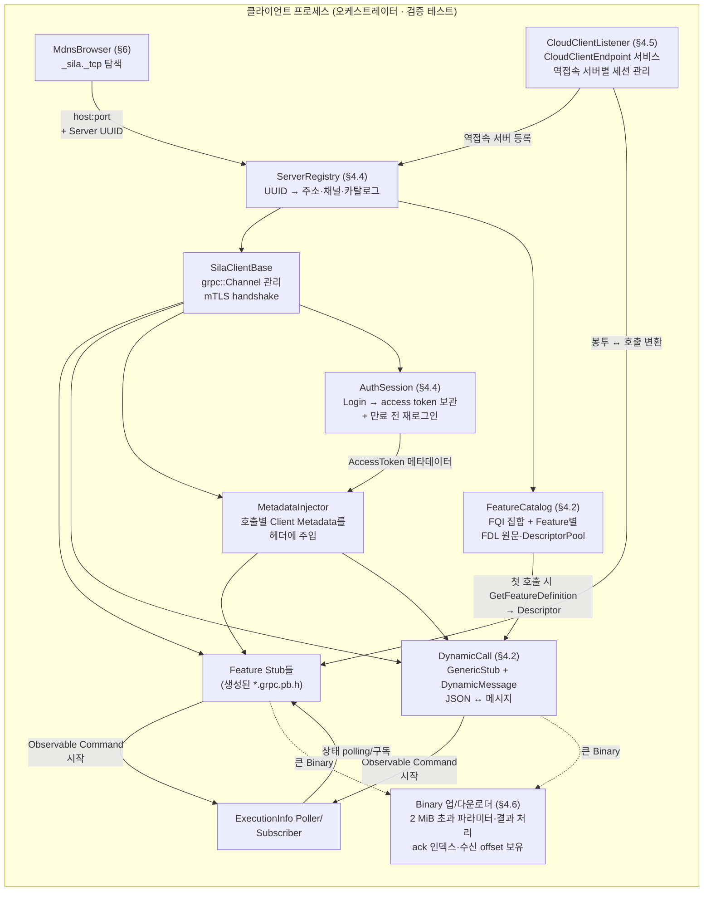

- 클라이언트 코어의 1차 소비자는 오케스트레이터(§1.1), 부차적으로 검증(`tests/validation`)과 서버-간 연동(다른 SiLA 장치 제어). 공통 골격은 서버 탐색 → 채널 생성 → 호출의 3단계, 마지막 단계가 정적 stub과 동적 호출로 갈림 (§4.1).
- 서버 축과 대칭으로 클라이언트에도 메타데이터 주입과 Binary 전송이 필요, 이 둘 없이 Client Metadata를 요구하는 RPC와 2 MiB 초과 Binary를 쓰는 커맨드를 클라이언트로 부를 수 없음. 인증 축(§3.11)을 활성화한 서버는 모든 호출이 `AccessToken` 메타데이터를 요구하므로 토큰 획득·부착도 같은 이유로 클라이언트 코어에 포함.

### 4.1 두 호출 경로 — 정적 stub과 동적 호출

오케스트레이터는 임의의 랩 장비를 발견하여 제어하므로 빌드 시 FDL을 아는 서버만 부를 수 있는 정적 stub으로는 부족, 런타임에 `GetFeatureDefinition`으로 받은 FDL을 해석하여 처음 보는 Feature를 호출하는 경로가 필수. sila_java `manager`가 `DynamicProtoBuilder`/`DynamicMessageBuilder`로, sila_cpp가 `CDynamicSiLAClient`로 각각 제공하는 경로로써, 본 프로젝트도 `sila2::dynamic` 타깃(§1.1)으로 포함.
| | 정적 stub | 동적 호출 |
|---|---|---|
| 대상 서버 | 빌드 시 FDL을 아는 서버 | 런타임에 FDL을 받아 알게 된 서버 |
| 메시지 | 생성된 `*.pb.h` 타입 | `google::protobuf::DynamicMessage` |
| 채널 | 생성된 `*::Stub` | `grpc::GenericStub` + `ByteBuffer` |
| 값 경계 | C++ 네이티브 타입 (§2.1) | JSON 문자열 ↔ 메시지 |
| 주 소비자 | 검증 테스트, 알려진 장비 연동 | 오케스트레이터 |

- 두 경로는 `SilaClientBase`의 채널·mTLS·메타데이터 주입(§3.6)·Binary 전송(§3.5) 위에 공존, 동적 경로는 런타임 디스크립터 조립(§4.2)을 필요.
- Binary Transfer 서비스는 `SiLABinaryTransfer.proto`로 고정되어 서버마다 달라지지 않으므로 동적 경로에서도 정적 stub 사용. 동적 경로는 파라미터 트리에서 2 MiB 초과 `Binary` 필드를 찾아 업로더로 넘긴 후, 그 필드의 `union` oneof를 `value` 대신 `binaryTransferUUID` 케이스로 채움.
- Observable Command·Property, Client Metadata도 동적 경로에서 같은 축(§3.3, §3.6)을 탐. 메타데이터 헤더 키가 FQI 파생이라 런타임에 구성 가능, 어떤 커맨드가 어떤 메타데이터를 요구하는지는 `Get_FCPAffectedByMetadata_<Metadata>`(§2) 호출로 확인.

### 4.2 런타임 디스크립터 파이프라인

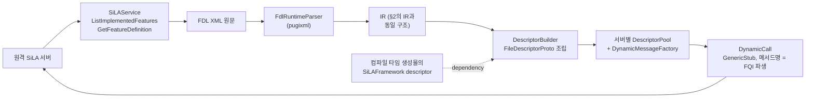

- 진입점은 서버 발견 후 `ListImplementedFeatures`로 FQI 목록만 확보, FDL 원문은 해당 Feature의 첫 호출 시점에 `GetFeatureDefinition` 1회로 지연 수집. 서버가 자기 정의를 원문으로 반환하는 구조(§3.2)가 상대편에서 그대로 소비됨.
- 디스크립터 조립은 `FileDescriptorProto`를 프로그래매틱하게 채워 `DescriptorPool::BuildFile`에 넘기는 방식. sila_cpp가 택한 `.proto` 텍스트 emit + `protobuf::compiler::Importer`(가상 `SourceTree`) 경로는 런타임에 libprotoc 의존과 텍스트 왕복이 붙고 오류가 컴파일러 진단 문자열로만 드러나므로 채택하지 않음, sila_java `DynamicProtoBuilder`가 같은 선택.
- `SiLAFramework.proto`의 descriptor는 컴파일 타임 생성물(§2)의 pool에서 가져와 dependency로 지정하므로써 동적 pool이 `SiLAFramework.String`·`SiLAFramework.Binary` 등을 참조 가능.
- 서로 다른 서버가 같은 FQI에 다른 정의를 반환할 수 있어 전역 pool 공유 금지, Pool은 서버 UUID별로 분리. `FeatureCatalog`가 UUID → (FQI 집합, Feature별 FDL 원문·pool·메서드 테이블)을 보유.
- 캐시 수명은 채널 수명, 연결이 끊긴 경우 폐기하고 영속 백엔드를 두지 않음. SiLA에 FDL 변경 알림 채널이 없고 FQI에 담기는 버전이 major뿐이라 펌웨어 갱신 감지 수단이 없으므로, 무효화 판정은 재연결 시 확보하는 FQI 집합에 위임 — 목록에서 빠졌거나 major 버전이 오른 FQI가 이 비교로 드러남. FQI가 같은 채 본문만 바뀐 FDL은 어느 정책으로도 판정 불가, 채널 수명을 캐시 수명으로 정의하여 덮음. 지연 수집이므로 재연결이 요구하는 RPC는 `ListImplementedFeatures` 1회.
- 호출은 `grpc::GenericStub`에 메서드 이름 문자열(`/sila2.org.silastandard.core.silaservice.v1.SiLAService/GetFeatureDefinition`)을 직접 지정, 필요한 형태는 unary와 server-streaming 둘. 생성된 타입 stub 아래에서 `GenericStub`·`CompletionQueue`로 `ByteBuffer`를 직접 주고받는 층으로써, gRPC 저장소의 `test/cpp/util/cli_call.h`를 옮겨온 sila_cpp `CDynamicCall`과 같은 자리.
- 파라미터·응답 값은 protobuf `json_util`의 `JsonStringToBinaryString`/`BinaryToJsonString`에 동적 pool 기반 `TypeResolver`를 물려 JSON 문자열로 주고받음, sila_cpp `CDynamicValue` 같은 자체 동적 값 트리는 만들지 않음 (sila_java `SiLACall`도 파라미터를 JSON 문자열로 표현).
- FDL Constraint는 proto에 없으므로(§2.1) 동적 경로의 파라미터 검증은 IR에 남은 Constraint로 클라이언트가 선검사, 최종 판정은 서버의 `ValidationError`(§3.4).
- 선검사 대상은 값 하나만으로 판정되고 외부 의존이 붙지 않는 Constraint로 한정 — `Length`·`MinimalLength`·`MaximalLength`, `Set`, `Pattern`, `Minimal/MaximalInclusive`·`Exclusive`, `ElementCount` 계열, `FullyQualifiedIdentifier` 형식 검사. 구현이 `std::regex`와 수치 비교로 충족되어 `sila2::dynamic`에 새 의존이 붙지 않음.
- 선검사 대상에서 `Schema`·`ContentType`·`AllowedTypes`은 제외. `Schema`·`ContentType`은 스키마 검증기·MIME 파싱이라는 외부 의존을 요구하여 서버 판정에 위임(§4.2의 런타임 XSD 검증 배제와 같은 근거), `AllowedTypes`는 `Any`의 런타임 타입 판정(§2.1)에 걸려 마찬가지. `Unit`은 값의 물리 단위를 서술하는 정보성 메타데이터로써 위반 판정 대상 자체가 없음.
- 판정 도구로써 서버 축의 공용 검사 헬퍼 `src/sila/types/constraints.h`(§3.4)를 호출, 입력만 `<Feature>Meta`의 Constraint 대신 런타임 IR에서 옴. 정적·동적 두 경로가 같은 함수를 공유하여 §4.3이 감시하는 이중 구현이 늘지 않음.
- XSD 검증은 빌드 타임 `xsdata` 바인딩(§2)의 몫이므로, 런타임 파싱은 전수 검증 없이 필수 요소 존재 확인까지만 수행. 원격 FDL이 스키마를 위반한 경우 파싱·조립 단계에서 드러남.
- 런타임 파서는 pugixml(MIT, 헤더 + `.cpp` 한 쌍)을 `sila2::dynamic` 내부 의존으로 사용, XPath 1.0으로 중첩 `DataTypeDefinition`·`Constraint`를 수동 하강 없이 탐색. XSD 검증·네임스페이스 해석을 갖춘 libxml2는 위 항목이 런타임 검증을 배제하여 강점이 사장되고 C API 래퍼 비용만 남으므로 채택하지 않음.
- `DescriptorBuilder`는 FDL 전체뿐 아니라 `Any`의 타입 정의 XML 하나(§2.1)도 입력으로 받아, 익명 Structure를 합성한 뒤 같은 조립 경로로 descriptor를 산출. sila_java `ProtoMapper.dataTypeToDescriptor`와 같은 진입점.

### 4.3 두 매핑 구현의 등가성

FDL → proto 매핑 규칙이 빌드 타임 `proto_emitter.py`(§2)와 런타임 `DescriptorBuilder`(§4.2) 두 곳에 존재, 어긋나는 경우 같은 장비를 정적 경로와 동적 경로가 다르게 호출하여 상호운용이 깨짐.
- codegen이 산출하는 `FileDescriptorSet`(§2)이 비교 기준.
- `tests/dynamic`이 sila_base의 전 Feature FDL에 대해 런타임 빌더 산출 `FileDescriptorProto`와 `.desc`를 정규화(필드 순서·기본값 생략 여부) 후 비교, 불일치 시 실패.
- 파생 RPC 이름 규칙(§2)·Binary oneof(§3.5)·`Any` 표현(§2.1) 변경 시 두 구현을 함께 수정해야 함, 이 테스트가 한쪽만 고친 변경을 잡아냄.

### 4.4 `ServerRegistry` — 오케스트레이터 대면 진입점

오케스트레이터가 다루는 단위는 서버이므로, 채널 하나에 대응하는 mDNS 탐색(§6)·수동 주소 지정·연결 수명·Feature 카탈로그(§4.2)를 한 객체가 서버 단위로 소유.
- `ServerRegistry`: UUID → (`ServerAddress`, 채널, `FeatureCatalog`, 연결 상태). mDNS 이벤트와 수동 등록 두 경로로 항목 추가, sila_java `ServerManager`·sila_cpp `CServerManager` 대응.
- 연결 상태는 gRPC 채널 상태(`GRPC_CHANNEL_*`) 구독과 mDNS goodbye(§6) 두 소스로 갱신, 장비 재부팅 후에도 UUID가 유지되는 정책(§3.7)이 재바인딩 근거.
- 오케스트레이터 대면 훅은 다섯으로 한정: `ObservableCommand`의 취소 신호(§3.3), `ServerRegistry`의 연결 상태 변경 콜백, `ClientConfig`에 설정한 `LockController` lock identifier의 호출별 메타데이터 자동 부착(§3.6), `AuthSession`이 확보한 access token의 같은 자리 부착(§3.11), `RecoverableErrors` 구독과 continuation option 전송(§3.12). 다섯 모두 관측한 사실 전달과 설정값 부착까지, 재시도·재스케줄·타임아웃 판정과 어느 옵션을 고를지는 넣지 않음.
- `AuthSession`: `ClientConfig`의 자격증명으로 `AuthenticationService.Login`을 1회 호출하여 토큰을 확보, 응답 `TokenLifetime`으로 만료 시각을 계산한 후 만료 전 재로그인. 서버가 `InvalidAccessToken`(§3.11)을 반환한 경우 그대로 호출자에게 전달, 실패한 호출의 재시도는 오케스트레이터 몫. 토큰 검증 실패와 권한 부족을 구분하는 것은 서버가 붙인 DefinedExecutionError 식별자.
- 서버 개시 연결(§3.9)로 붙은 서버는 mDNS에 나타나지 않으므로, `CloudClientListener`(§4.5)가 역접속을 받은 시점에 같은 레지스트리로 항목 등록 — 오케스트레이터에게 두 연결 방식이 같은 인터페이스로 보임.
- 오케스트레이터가 FQI를 보관해 두고 호출하는 경우, 보관 FQI는 힌트로 취급하고 유효성은 연결 시점에 확보한 FQI 집합(§4.2)이 판정 — 집합에 없는 FQI는 호출 전 거부.
- 호출 결과 수거(Observable Command 상태 구독, Observable Property 구독)는 호출자 쪽 콜백으로 전달, 커맨드 큐잉·우선순위·재시도는 오케스트레이터 책임 (§9.2).

### 4.5 `CloudClientEndpoint` 수신 — 클라이언트 측

서버 개시 연결(§3.9)의 상대역은 클라이언트가 서비스로 띄우는 `CloudClientEndpoint`. sila_python `DriverValidationSuite`가 mDNS 디스커버리와 수동 주소 지정 두 방식만 지원하여 이 모드의 외부 검증 레퍼런스가 없으므로, `SilaClientBase`에 수신 측 구현을 함께 둠.
- `CloudClientListener`: `ConnectSiLAServer` 서버 스트리밍을 받아 역접속한 서버별 세션을 관리, 요청마다 `requestUUID` 발급 후 응답 봉투를 대기 중인 호출로 라우팅.
- 봉투 페이로드 직렬화·역직렬화는 정적 경로가 `<Feature>Meta` 테이블(§3.8)을, 동적 경로가 `FeatureCatalog`의 pool(§4.2)을 사용. 봉투는 페이로드를 `bytes`로 나르므로 두 경로 모두 같은 라우팅 코드를 탐.
- 검증은 `tests/interop`에서 이 클라이언트로 C++ 서버의 역접속을 받아, 클래식 경로와 동일 시나리오를 실행한 뒤 두 경로의 응답 동등성을 비교(§7).

### 4.6 Binary 전송 재개 — 클라이언트 측

수백 MB 결과를 다루는 이미징 장비에서 전송 도중의 연결 단절이 정상 시나리오이므로, 절단마다 처음부터 다시 올리지 않도록 재개 상태를 클라이언트가 보유 (§3.5).
- `BinaryUploader`는 전송 단위로 `binaryTransferUUID`, ack 받은 청크 인덱스 집합, 원본 소스 핸들을 보유. 스트림이 끊긴 경우 지수 백오프로 `UploadChunk`를 다시 개설한 후 미ack 인덱스만 재전송.
- `BinaryDownloader`는 마지막으로 수신한 offset을 보유, 재개는 그 offset부터의 `GetChunk` 재요청.
- `BinaryTransferError{INVALID_BINARY_TRANSFER_UUID}` 수신은 수명 만료로 슬롯이 사라졌다는 신호로써, 이 경우에만 `CreateBinary`부터 다시 시작. `BINARY_UPLOAD_FAILED`·`BINARY_DOWNLOAD_FAILED`는 호출자에게 전달.
- 재개 시도 횟수와 백오프 상한은 `ClientConfig` 설정값, 상한 초과 시 실패를 호출자에게 전달. 한 전송 안에서 닫히는 재개이므로 커맨드 재시도·재스케줄을 넣지 않는 §4.4의 훅 경계는 유지.
- 동적 경로(§4.1)도 같은 업로더를 경유, 재개 로직이 두 호출 경로에 중복되지 않음.

## 5. 엔드투엔드 시퀀스: Observable Command 실행

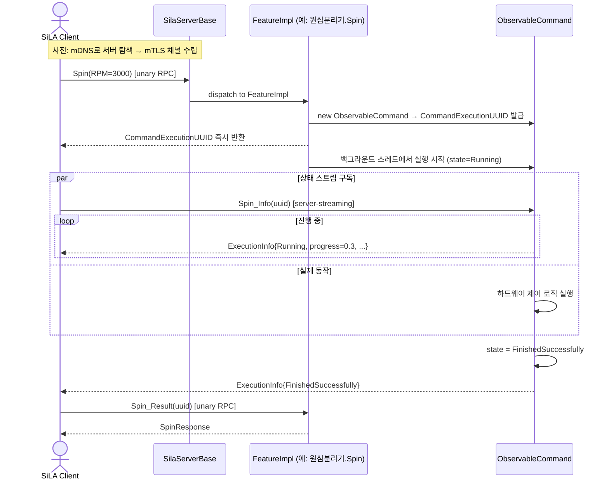

## 6. 디스커버리 흐름 (mDNS)

mDNS 응답기를 시스템 데몬에 위임하지 않고 `mdns`(mjansson, Unlicense) 헤더 전용 라이브러리 위에 코어가 직접 구현. 라이브러리는 소켓 개설(`mdns_socket_open_ipv4`·`_ipv6`)과 레코드 단위 송수신(`mdns_announce_multicast`·`mdns_goodbye_multicast`·`mdns_socket_listen`·`mdns_query_answer_multicast`·`mdns_query_send`·`mdns_discovery_send`·`mdns_query_recv`) 제공. 내부 할당이 없어 수신 버퍼·스레드·레코드 수명은 코어 몫.

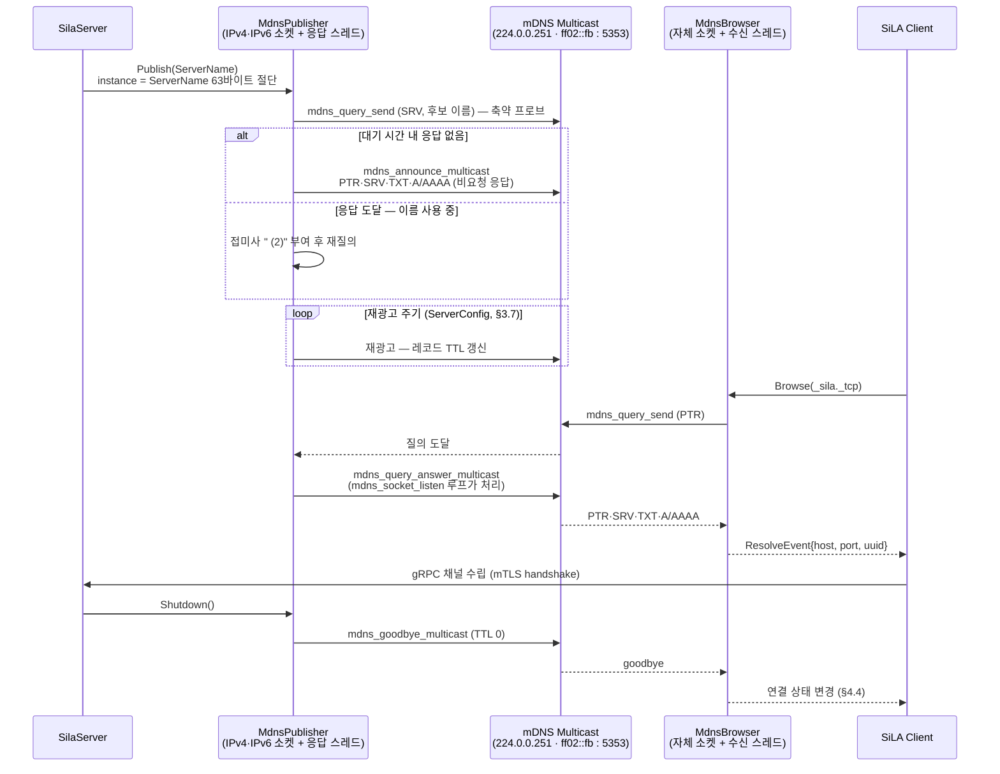
- `MdnsPublisher`는 광고 외에 `mdns_socket_listen` 루프 스레드를 함께 보유. 비요청 응답 1회로는 광고 이후 켜진 클라이언트의 질의에 답하지 못하므로, 응답 경로가 데몬 없이 성립하려면 이 루프가 필수.
- 인스턴스 이름은 `ServerName`(§3.7). `avahi-browse`와 타 SiLA 클라이언트 목록에서 장비를 사람이 식별하는 값이므로 UUID 파생 이름을 쓰지 않고, 대신 중복 가능성이 생겨 충돌 해소가 필요.
- 충돌 해소는 축약 프로브 — 광고 전 후보 이름으로 SRV 질의 1회, `ServerConfig`(§3.7)의 대기 시간 내 응답이 오면 RFC 6762 §9 관례대로 접미사 `" (2)"`를 붙여 재질의. RFC 6762 §8의 250ms 간격 3회 프로브와 rate limit은 도입하지 않음(§9.2), 부팅 지연을 질의 1회분으로 묶는 쪽을 택함.
- `ServerName`의 FDL 제약은 `MaximalLength` 255인 반면 mDNS 인스턴스 레이블은 63바이트(RFC 6763 §4.1.1)이므로, 후보 이름은 UTF-8 경계에서 63바이트로 절단. 접미사 부여 시 접미사를 포함해 63바이트가 유지되도록 재절단.
- `SiLAService.SetServerName` 수신 시 goodbye 후 새 이름으로 프로브·재광고. 이름이 바뀌어도 TXT의 UUID가 같으므로 `ServerRegistry`(§4.4)는 같은 항목으로 판정.
- 재광고 주기와 레코드 TTL은 `ServerConfig`(§3.7) 조정값. 데몬이 맡던 갱신 책임이 이 타이머로 옮겨옴.
- `MdnsBrowser`는 자체 소켓·스레드로 `_sila._tcp` PTR 질의 후 SRV·TXT·A/AAAA를 조립하여 `ResolveEvent` 산출, goodbye 수신은 `ServerRegistry`(§4.4)의 연결 상태 소스 둘 중 하나.
- 같은 호스트에 `avahi-daemon`이 상주하는 경우 `SO_REUSEADDR`·`SO_REUSEPORT`로 5353 공존. 데몬은 코어가 조립한 레코드를 모르므로 `_sila._tcp` 응답을 분담하지 않음.
- IPv4·IPv6 소켓을 함께 열고 A·AAAA를 모두 광고, Publisher와 Browser가 각자 소켓 쌍과 스레드를 소유하여 장비 측 빌드에 질의 경로가, 오케스트레이터 빌드에 응답 경로가 들어가지 않음.

## 7. 테스트 레이어와 신뢰 경계

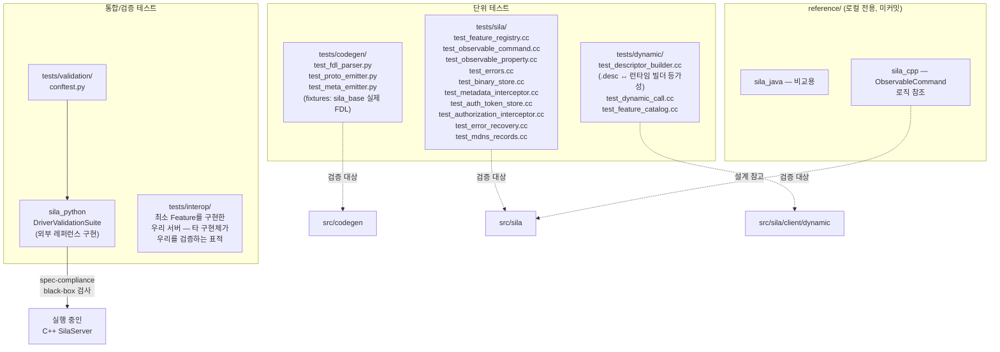

- 스펙 준수 여부를 외부 기준으로 판단하기 위해, `tests/validation`은 C++ 서버를 실제로 띄운 후 SiLA2 공식 Python 레퍼런스(`sila_python`)의 `DriverValidationSuite`로 블랙박스 검증.
- 동적 호출 경로는 `tests/interop`의 C++ 서버를 표적으로 같은 커맨드를 정적 stub과 동적 경로로 각각 호출한 뒤 응답을 비교, 매핑 등가성(§4.3)이 실제 호출에서도 성립하는지 확인.
- Binary 전송 재개는 `tests/sila`가 수신 인덱스 집합·멱등 저장을(§3.5), `tests/interop`이 전송 도중 스트림을 끊고 이어 올리는 시나리오를(§4.6) 각각 검증. sila_base의 `org.silastandard/test/BinaryTransferTest/v1`이 그 표적 Feature.
- 인증 축(§3.11)의 외부 검증 표적은 sila_base가 제공하는 `org.silastandard/test/AuthenticationTest/v1` — `tests/interop` 서버가 이 Feature와 인증 3종을 함께 구현하여 sila_java `interoperability` 클라이언트가 토큰 발급·부착·거부 경로를 밖에서 확인. 에러 복구(§3.12)는 대응 test Feature가 없어 `tests/sila`의 게이트 단위 테스트와 `tests/interop`의 자체 시나리오로 검증.
- 설계 참고를 위한 `reference/sila_cpp` 레포는 빌드 시 제외.
## 8. 계층 요약

| 계층 | 위치 | 언어 | 책임 |
|---|---|---|---|
| 스펙/스키마 | `third_party/sila_base` (submodule) | XML/XSD/proto | FDL 정의, 공통 SiLAFramework 타입 — 태그 고정 |
| 코드 생성 | `src/codegen` | Python | XSD→바인딩, FDL → IR → `.proto` + `<Feature>Meta` |
| 생성 산출물 | `generated/` (gitignore) | proto/C++ | `protoc`/`grpc_cpp_plugin` 산출물 + FDL XML 임베드 |
| 타입 매핑 | `src/sila/types/` | C++ | SiLA Basic 타입 ↔ C++ 왕복, Any, Constraint 검사 헬퍼 |
| 런타임 코어 | `src/sila/{server,client,transport,discovery,errors,metadata,binary,auth,recovery}` | C++ | 인터셉터 체인, 5개 축, 트랜스포트 어댑터 2종, mDNS, 설정 영속화, `AuthTokenStore`·`RecoverableErrorGate` |
| 동적 호출 | `src/sila/client/dynamic/` | C++ | 런타임 FDL 파싱, Descriptor 조립, `GenericStub` 호출, `ServerRegistry` |
| core feature | `src/sila/features/` | C++ | `SimulationController`·`LockController`·`ConnectionConfigurationService`·인증 3종·`ErrorRecoveryService` 구현체 (§3.10~§3.12) |
| 참조 구현 | `examples/` | C++ | 새 장비 저장소가 복사해 출발하는 Feature 구현체 1종 |
| 검증 | `tests/validation`, `tests/interop`, `tests/dynamic` | Python(pytest) + C++ | 외부 레퍼런스 대비 스펙 준수 확인, 두 매핑 구현 등가성 |

`src/codegen`(Python)을 `tools/codegen`으로 옮겼던 §8 결정을 재검토하여 `src/codegen`으로 되돌림(2026-08-24). 본 레포는 `sila2::core`·`sila2::dynamic` (§1.1) 제공.

장치별 Feature 구현체를 담던 `src/features/`는 폐지. 실제 하드웨어와 통신하는 구현체는 벤더 SDK·장치 권한 의존과 연관되므로 장비 저장소 소관(§1.1), 본 레포는 예시 core feature 구현체와 `examples/`의 참조 구현 1종만 포함. `examples/`는 기본 빌드에서 제외하고 `-DSILA2_BUILD_EXAMPLES=ON`에서만 컴파일, `tests/interop`의 데모 서버와 달리 새 장비 레포의 출발점 제공이 목적.
## 9. 범위 결정

### 9.1 명시적 비목표 (현 구현에서 제외)

- 동적 Feature 서버: 서버 측은 컴파일 타임에 아는 Feature만 등록, 런타임에 FDL을 받아 서비스를 여는 경로는 만들지 않음. 동적 해석은 클라이언트 축에만 존재 (§4.1).
- 오케스트레이션 로직: 스케줄링·워크플로·장비 상태 머신은 상위 저장소 소관 (§1.1).
- 정적 stub 대체: 동적 경로 추가 후에도 검증 테스트와 알려진 장비 연동은 정적 stub 유지, 두 경로를 함께 관리 (§4.1).
- 바이너리 영속: `BinaryStore`(§3.5)는 수명 안에서의 연결 단절 재개를 지원(§4.6), 프로세스 재시작 이후 복구는 제외, 재시작 시 그 바이너리를 참조할 커맨드가 남지 않음(§3.5).
- 자격증명 저장소·권한 정책: 인터페이스 정의와 호출 지점은 코어 책임.`CredentialVerifier`·`AccessPolicy`(§3.11) 뒤의 사용자 관리·패스워드 정책·감사 로그는 사이트 정책에 딸리므로 오케스트레이터 소관.
- `AuthorizationProviderService` 서버 구현: provider 호출과 자기 발급 토큰의 로컬 검증은 (§3.11) 코어 책임. 여러 서버의 토큰을 대신 검증하는 중앙 provider 역할은 랩 인프라 소관.
- 토큰 영속: 재시작 후 access token 유효성은 제공하지 않음, 클라이언트가 `Login`을 다시 호출 (§3.7).
- 복구 절차 판정: `ErrorRecoveryService`(§3.12)에서 코어가 맡는 것은 에러 게시·대기·선택 전달, 어떤 continuation option을 제시하고 고를지는 Feature 구현체와 오케스트레이터 양쪽 (§1.1).

### 9.2 미결정/후속 트랙

- 서버 개시 연결(§3.9)의 외부 검증 레퍼런스 부재 — sila_python이 이 모드를 지원하지 않아 자체 `CloudClientEndpoint`(§4.5)로 자기 검증. 상호운용성은 sila_java 서버·클라이언트와 맞대볼 시점에 확인.
- 자체 mDNS 응답기(§6)의 상호운용 — 데몬 대신 코어가 레코드를 내보내므로, sila_java의 JmDNS·sila_python의 zeroconf가 `MdnsPublisher` 광고를 해석하는지와 `avahi-daemon` 상주 호스트에서의 5353 공존이 실측 대상. 축약 프로브(§6)가 놓치는 충돌 사례가 드러나는 경우 RFC 6762 §8 전량 프로브 도입이 후속 트랙.
