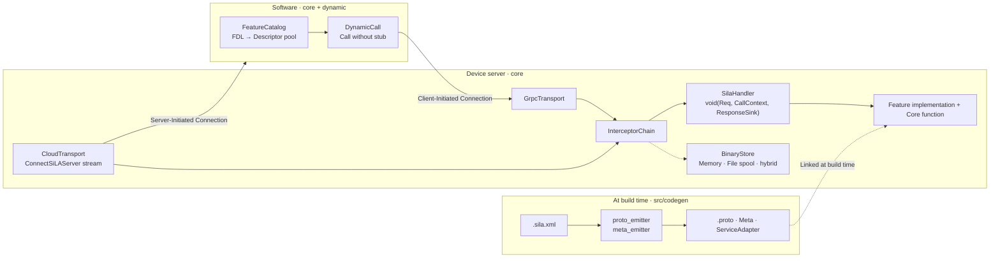
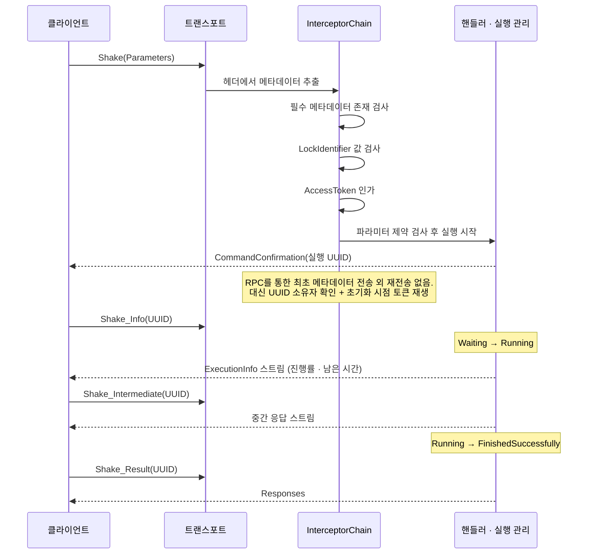

# sila_cpp_r

> **[English](../../README.md)**

SiLA 2 (Standardization in Lab Automation)의 C++20 구현체. 1.1버전 준수.  
실험실 자동화를 위한 장비와 소프트웨어 간 gRPC 기반 표준 프로토콜.  
  

v0.81-Beta.
## 개요

SiLA는 실험실 자동화 분야에서 실험 장비의 통합 및 소프트웨어 서비스에 대한 상호 운용성, 유연성 및 자원 최적화를 목표로 하여, gRPC와 표준 FDL (Feature Definition Language; XML) 양식을 사용하여 SiLA Server와 Client 간 통신을 정의하는 개방형 표준입니다. 

본 레포는 2022년 3월 19일 릴리즈된 정의 문서 1.1버전을 준수하고 있으며, 다음 규약 문서와 기본 구조가 포함된 레포를 기반으로 구현되었습니다.  
- [SiLA 2 Part (A) - Overview, Concepts and Core Specification](https://sila-standard.com/wp-content/uploads/2022/03/SiLA-2-Part-A-Overview-Concepts-and-Core-Specification-v1.1.pdf)  
- [SiLA 2 Part (B) - Mapping Specification](https://sila-standard.com/wp-content/uploads/2022/03/SiLA-2-Part-B-Mapping-Specification-v1.1.pdf)  
- [sila_base repository](https://gitlab.com/SiLA2/sila_base)  

이외에도 구현 시 기존 구현체와 타 언어 구현체를 참고했습니다.  
- [sila_cpp repository](https://gitlab.com/SiLA2/sila_cpp)    
- [sila_java repository](https://gitlab.com/SiLA2/sila_java)  
- [sila_python repository](https://gitlab.com/SiLA2/sila_python)  

SiLA 프로토콜은 FDL을 통해 표준화된 방식으로 장비에 명령을 내리거나 측정값을 실시간으로 받아볼 수 있게 합니다. 정의에 따르면 SiLA 프로토콜을 지원하는 장비와 이 장비를 제어하는 소프트웨어를 각각 서버와 클라이언트로 정의합니다. 둘이 통신을 하기 위해선 클라이언트는 서버의 FDL을 가지고 있어야 합니다.  

이를 위해, 서버가 최초 연결 시 클라이언트에게 내장된 FDL을 제시하거나 (`SiLAService::GetFeatureDefinition`), 벤더사로부터 별도로 배포받아 연결하는 방식으로 (`FeatureCatalog::add`) 클라이언트는 서버가 어떤 명령과 상태를 읽고 보낼 수 있는지 파악할 수 있어, 그에 따른 알맞은 명령으로 제어할 수 있게 됩니다..  
이 레포는 SiLA 프로토콜 C++ **재**구현체입니다. 기존 `sila_cpp`의 Qt 종속성을 제외하고 실 사용을 위해 재구현했습니다.
## 라이브러리 구성

- `sila_cpp_r::core` — 서버 인스턴스 생성, 정적 stub 클라이언트, 바이너리 전송, 클라우드 연결, 인증·인가, 에러 복구, mDNS Discovery, FDL 런타임 파싱과 제약 검사
- `sila_cpp_r::dynamic` — sila_cpp_r::core 위에서 동작; core의 채널(`grpc::Channel`), 인젝터(`MetadataInjector`) 등과 연결. 파싱된 FDL로 protobuf descriptor를 생성 후, stub 없이 동적 RPC 호출.
 
본 레포는 사용 기기의 특성에 따라 하위 라이브러리를 선택하여 쓰도록 설계했습니다. 기기 목적에 맞게 `sila_cpp_r_dynamic`와 `sila_cpp_r::core`를 선택해서 사용하세요. `sila_cpp_r::dynamic`은 여러 장비로부터의 메세지를 받아, 빌드 시점에 알 수 없는 protobuf 메시지를 런타임에 해석할 수 있게끔 소프트웨어 입장에서 설계했고, `sila_cpp_r::core`은 컴퓨팅 자원이 한정되어, 하드웨어에 의해 기능이 이미 정의되어 있는 장비에 이식하여 사용할 수 있게 설계했습니다. `sila_cpp_r::core` 사용 시, 장비의 FDL을 codegen으로 .proto IDL(Interface Description Language) 변환, 이후 protoc/grpc_cpp_plugin으로 컴파일하여 얻은 정적 stub과 함께 쓰이도록 설계했습니다.
| | 장비 (SiLA Server) | 소프트웨어 (SiLA Client) |
|---|---|---|
|  Stub | codegen의 FDL 변환 → `.proto` + static stub + Metadata | 없음 — 통신 상대의 FDL 동적 해석 |
| 링크 | `sila_cpp_r::core` | `sila_cpp_r::dynamic`(+`sila_cpp_r::core`) |
| FDL 런타임 해석 | 파라미터 제약 검사 (`CommandParameterValidator.cc`) | 파라미터 제약 검사 + 메시지 동적 직렬화/역직렬화. |

## 아키텍처



## 프로토콜 흐름




## sila_cpp와의 차이

SiLA 공식 C++ 레퍼런스인 [sila_cpp](https://gitlab.com/SiLA2/sila_cpp)와 비교하여, 장비에 내장되어 드라이버와 함께 실사용을 목적으로 의존성을 줄여 설계했습니다.
| | sila_cpp | 본 레포 |
|---|---|---|
| 기반 | Qt5 Core (`QObject`, Qt PIMPL) | 표준 C++20, Qt 없음 |
| 의존성 | Conan v1 또는 시스템 설치 | vcpkg 매니페스트 + 서브모듈 |
| mDNS | Avahi(리눅스) / Bonjour(윈도우) | 단일 헤더 `mdns`, 플랫폼 공통 |
| 코드 생성 | C++ 안에 FDL 파서 내장 | Python + Jinja2 빌드 도구, 골든 파일로 고정 |
| 전송 계층 | gRPC 직결 | `SilaHandler` / `ResponseSink` / `CallContext` 추상 — gRPC와 클라우드 두 경로가 같은 핸들러를 공유 |
| 테스트 | Catch2 | GoogleTest + pytest + 새니타이저 프리셋 + libFuzzer + 상호운용 테스트 |

또한, `sila_cpp`은 SiLAService와 Observable 명령·속성, 발견, 동적 클라이언트만을 구현했다면, 본 레포는 SiLA2 Specification 문서에 명시되어 있는 바이너리 전송(Part B), 클라우드 연결(Part B), 에러 복구·인증·인가·잠금·시뮬레이션(Part C)를 모두 준수하려 했습니다.


## 요구 사항

- CMake ≥3.25
- C++20 (GCC 13+ 또는 Clang 16+ 기준)
- Python ≥3.10 
- uv
- vcpkg
- 서브모듈 `third_party/sila_base` — 규격 원문·스키마·프로토, 빌드에 반드시 필요

#### codegen Python packages (`src/codegen/pyproject.toml` / `uv.lock`)

| 패키지 | 버전 | 용도 |
|---------|---------|------|
| `lxml` | 6.1.2 | FDL XSD 검증·XML 파싱 |
| `xsdata` | 26.2 | FDL XSD → Python 데이터 바인딩 생성 |
| `Jinja2` | 3.1.6 | `.proto`·Meta 템플릿 렌더링 |
| `pytest` | 9.1.1 | 코드 생성기 테스트 (uv `validation` 그룹, 선택 시 함께 포함) |
| `sila2` | 0.14.0 | 교차언어 검증 — SiLA 2 Python 구현체 (uv `validation` 그룹, 선택) |

#### vcpkg dependencies (`vcpkg.json`)

| 패키지 | 버전 | 용도 |
|---------|---------|------|
| `protobuf` | 6.33.4 | gRPC 메시지 직렬화 |
| `grpc` | 1.81.1 (overlay) | RPC 트랜스포트 |
| `libxml2` | 2.15.3 | FDL XSD 검증(런타임) |
| `libxslt` | 1.1.45 | FDL 정규화 변환(런타임) |
| `mdns` | 1.4.3 (overlay) | mDNS 디스커버리 |
| `nlohmann-json` | 3.12.0 | JSON 파싱 |
| `json-schema-validator` | 2.4.0 | JSON Schema 검증 |
| `boringssl` | 2025-08-18 | TLS |
| `gtest` | 1.17.0 | 테스트 |
| `opentelemetry-cpp` | 1.28.0 | 선택 기능 `otel` — OpenTelemetry 계측 빌드 시 사용 |

## 빌드

```bash
git clone --recursive <repo-url>
cd sila_cpp_r

cmake --preset default
cmake --build build/gcc
```


| 프리셋 | 빌드 디렉터리 | 용도 |
|---|---|---|
| `default` | `build/gcc` | GCC, RelWithDebInfo |
| `clang` | `build/clang` | Clang 빌드 |
| `asan` | `build/asan` | AddressSanitizer + UBSan, 메모리 검사 |
| `tsan` | `build/tsan` | ThreadSanitizer (Clang; GCC TSan은 WSL2 ASLR 이슈) |
| `otel` | `build/otel` | OpenTelemetry 추적 활성화 |
| `fuzz` | `build/fuzz` | libFuzzer 타깃 |

## 테스트

```bash
uv sync --directory src/codegen                       # 코드 생성기
uv sync --directory src/codegen --group validation    # + 상호 검증 스위트
```

`ctest`의 테스트 스위트 중 일부가 pytest를 포함하기에, `ctest`실행 전 python interpreter와 동기화가 필요합니다.

```bash
ctest --preset default             # 전체
ctest --preset default -R codegen  # 생성기만
ctest --preset asan                # 메모리·정의되지 않은 동작
ctest --preset tsan                # 데이터 경합

cmake --preset fuzz && cmake --build build/fuzz # fuzzing
./build/fuzz/tests/fuzz/fuzz_fdl_parser -max_total_time=60
```


### 검증 범위

| 검증 항목 | 검증 방법 및 결과 |
| --- | --- |
| 메모리 무결성 | ASan + UBSan: 모든 테스트를 AddressSanitizer와 UndefinedBehaviourSanitizer에서 검증. |
| 데이터 경합 | TSan (Clang) — gRPC·abseil·BoringSSL 내부 경합에는 namespace-level suppressions으로부터 경합 0건 확인. OwnedComponents 소멸자의 gRPC teardown 상호작용으로 인한 termination-order 경합은 알려진 종료 시점 이슈로, 현재 검증 범위 내에선 런타임 결함 미검출. |
| 입력 견고성 | Fuzz 테스트 4개(FDL 파서, mDNS 패킷 파서, `CloudEnvelopeRouter`, `JsonCodec`) — 크래시 0건. |
| 테스트 안정성 | 전체 스위트를 20회 반복하는 soak 테스트 — flaky 테스트 0건. |
| 이식성 |GCC, Clang 빌드 확인, OTel 활성화된 빌드에서도 전체 테스트 통과 확인. |

## 짧은 예시

BioShake QX의 `TemperatureController.sila.xml` 사용 예:

### Codegen

```bash
cd src/codegen
python -m codegen ../../tests/examples/fdl/bioshake-qx/TemperatureController.sila.xml -o generated/
# generated/
#   TemperatureController.proto
#   TemperatureControllerMeta.h/.cc
#   TemperatureControllerServiceAdapter.h
```

Codegen으로 proto, Meta 헤더·소스, 어댑터 헤더 파일 생성. 서버(장비) 코드에 포함시켜 사용.
- `<...>.proto`: protobuf IDL. 정적 stub으로, `protoc`/`grpc_cpp_plugin`으로 컴파일하여 사용.
- `<...>Meta.h/.cc`: FQI (Fully Qualified Identifier)가 담긴 헤더와, FDL XML 원문이 소스에 raw string literal로 정의되어 출력.
- `<...>ServiceAdapter.h` — gRPC 서비스 클래스. 각 RPC 처리 시 `dispatchToHandler`가 등록된 인터셉터를 순서대로 실행하고 (`InterceptorChain::intercept()`), 모두 통과하면 `SilaHandler<Req, Resp>` 콜백을 호출.

XML 변환을 위해 `third_party/sila_base/schema/FeatureDefinition.xsd`를 사용.  
경로가 변경 시 `--xsd`로 지정.

### 서버 생성

```cpp
namespace gen = sila2::generated::temperaturecontroller;

sila2::SilaServerBase::Builder builder;
builder.withSelfSignedCertificate("localhost", "127.0.0.1")
       .withConfig(std::make_unique<sila2::InMemoryServerConfig>("BioShakeQX"));

// TemperatureControllerImpl은 codegen이 생성한
// TemperatureControllerServiceAdapter를 내장하여,
// 생성자에서 각 RPC에 대한 핸들러를 등록하는 Feature 구현 클래스
TemperatureControllerImpl impl(builder.chain());

// AddFeature를 통해 서버에게 FQI ID, FDL XML 원문, gRPC 서비스 포인터(TemperatureControllerServiceAdapter) 전달.
// With(...) 메서드를 붙여 발견, 바이너리 전송, 인증, 에러 복구, 클라우드 연결 (withBinaryTransfer, withAuthentication, withErrorRecovery, withConnectionConfiguration).
// build()를 통해 현재까지 붙인 메소드에 대응하는 인터셉터와 gRPC 서비스를 생성·등록.
auto server = builder
    .addFeature(std::string{gen::kFqi}, std::string{gen::kFdlXml}, impl.service())
    .registerCommandManager(&impl.commandManager())
    .withDiscovery(50052)
    .build();

server.run(true);
```  

### 클라이언트 사용

```cpp
// .proto로부터 생성된 네임스페이스
namespace tc = sila2::org::silastandard::examples::temperaturecontroller::v1;

// TLS CA + 로그인 자격 증명: 연결 시 자동으로 토큰을 받아 RPC 헤더에 주입
sila2::ClientConfig config;
config.setTlsCredentials({.caCertificatePem = serverCaPem});
config.setUserCredentials("alice", "secret");

sila2::SilaClientBase client{"127.0.0.1", 50052, std::move(config)};
auto stub = client.createStub<tc::TemperatureController::Stub>(); // 이 채널에 연결된 정적 gRPC stub을 반환
client.authenticate(serverUuid);
```

## 구조

```
src/
  codegen/                                  FDL → proto·Meta·어댑터 생성기 (Python, Jinja2)
  sila/
    common/
      error/
        SilaError.h/.cc                     Framework·Validation·DefinedExecution·Undefined 에러 타입
      types/
        BasicTypes.h                        SiLA 기본 타입 (Integer, Real, String 등) C++ 매핑
        Constraints.h/.cc                   FDL 제약 조건 정의·검사
      tls/
        UntrustedTlsCredentials.h/.cc       자체 서명 인증서 TLS 자격
      proto/                                코어 기능 .proto 원본 (SiLAService, AuthenticationService 등)
      discovery/
        MdnsSocketPair.h                    mDNS 소켓 — 서버·클라이언트 공용
    server/
      SilaServerBase.h/.cc                  서버 빌더 — With... 메서드로 기능 구성, build()로 생성
      FeatureRegistry.h/.cc                 Feature FQI·FDL·gRPC 서비스 등록·조회
      SilaServiceImpl.h/.cc                 SiLAService 구현 — GetFeatureDefinition 등 코어 RPC
      CommandParameterValidator.h/.cc       FDL 제약 기반 파라미터 런타임 검사
      config/
        ServerConfig.h/.cc                  서버 설정 저장·로드
        TlsConfig.h/.cc                     TLS 인증서·키 설정
      command/
        ObservableCommandExecution.h/.cc    상태 머신 (Waiting → Running → Finished)
        ObservableCommandManager.h/.cc      실행 인스턴스 생성·조회·GC
      property/
        ObservablePropertyManager.h/.cc     Observable Property 구독·브로드캐스트
      binary/
        BinaryStore.h/.cc                   저장소 인터페이스 + 3 구현 (InMemory, FileSpool, Hybrid)
        BinaryUploadService.h/.cc           업로드 gRPC 서비스
        BinaryDownloadService.h/.cc         다운로드 gRPC 서비스
      auth/
        AuthTokenStore.h/.cc                토큰 발급·검증·만료 관리
        AuthorizationInterceptor.h/.cc      RPC별 접근 토큰 검사 인터셉터
        AccessPolicy.h                      FQI별 접근 정책 인터페이스
        CredentialVerifier.h                사용자 자격 검증 인터페이스
      recovery/
        RecoverableErrorGate.h/.cc          복구 가능 에러 대기·재개·중단
        ErrorRecoveryServiceImpl.h/.cc      ErrorRecoveryService gRPC 구현
      features/
        AuthenticationServiceImpl.h/.cc     인증
        LockControllerImpl.h/.cc            잠금 제어
        SimulationControllerImpl.h/.cc      시뮬레이션 모드
        ConnectionConfigurationServiceImpl.h/.cc  클라우드 연결 설정
      transport/
        SilaHandler.h                       핸들러 콜백 — void(Req, CallContext, ResponseSink)
        ResponseSink.h                      응답 채널 추상 — gRPC·클라우드 공용
        CallContext.h/.cc                   RPC 메타데이터 접근
        InterceptorChain.h                  인터셉터 묶음 — auth, binary, lock, log
        GrpcTransport.h/.cc                 gRPC 직결 트랜스포트
        cloud/
          CloudTransport.h/.cc              서버 개시 연결 (ConnectSiLAServer 스트림)
          CloudEnvelopeRouter.h/.cc         봉투 역직렬화·핸들러 디스패치
          StreamWriteSerializer.h/.cc       동시 스트림 쓰기 직렬화
      metadata/
        MetadataExtractingInterceptor.h/.cc gRPC 헤더에서 SiLA 메타데이터 추출
      discovery/
        MdnsPublisher.h/.cc                 mDNS 서비스 게시
    client/
      SilaClientBase.h/.cc                  정적 stub 클라이언트 — TLS 채널, 인증, 메타데이터 주입
      ClientConfig.h/.cc                    TLS·사용자 자격 설정
      MetadataInjector.h/.cc                gRPC 메타데이터 자동 주입 (잠금·인증 토큰)
      AuthSession.h/.cc                     인증 세션 — 토큰 발급·갱신
      dynamic/
        FeatureCatalog.h/.cc                FDL → Descriptor pool 등록·조회
        FdlRuntimeParser.h/.cc              FDL XML 런타임 파싱
        DescriptorBuilder.h/.cc             파싱된 FDL → protobuf Descriptor 생성
        DynamicCall.h/.cc                   stub 없이 동적 RPC 호출
        JsonCodec.h/.cc                     JSON ↔ protobuf 변환
      binary/
        BinaryUploader.h/.cc                청크 업로드·재시도
        BinaryDownloader.h/.cc              청크 다운로드·재시도
      discovery/
        MdnsBrowser.h/.cc                   mDNS 서비스 탐색
tests/
  sila/               단위·통합 테스트 (gtest)
  codegen/            생성기 테스트와 골든 파일 (pytest)
  examples/           ShakeController 예제 서버와 종단 테스트
  interop/            상호운용 테스트
  fuzz/               FDL 파서·JSON 코덱·mDNS 파서·클라우드 라우터 퍼징
  validation/         드라이버 검증 (pytest)
  physical/           라즈베리파이 실기 검증 스크립트
reference/
  sila2-specification/  Part A·B·C 원문 PDF
  docs/                 설계 문서
```

## 라이선스

이 프로젝트는 다른 SiLA2 구현체 (`sila_python`, `sila_java`, `sila_cpp`)와 같이 [MIT License](LICENSE) 하에서 배포됩니다.
